## uni-app（神领物流）项目实战 - 第1天


**学习目标：**

- 能够搭建 uni-app 基础开发环境
- 知道 uni-app 跨端开发的基本思路
- 掌握安卓真机运行环境配置步骤
- 掌握 uni-app 中关于配置、组件以及 API 的使用
- 掌到 uni-app 跨平台兼容的处理方式


### 一、搭建基本开发环境

在本节要求大家掌握 uni-app 项目的创建、运行、以及 Android 真机环境配置，内容侧重于动手操作，需要理解的部分较少，操作过程中遇到错误后，可以从头重新进行操作，直到环境正常运行。


#### 1.1 创建项目

在使用 uni-app 框架进行开发时有两种方式来创建项目，一种使用 cli 方式创建，另一种是通过 HBuilder X 方式创建，这两种方式本质上并无差别，采用哪种方式取决于自已项目的定位。

##### 1.1.1 HBuilder X 方式

- 安装 HBuilder X

  [HBuilder X](https://www.dcloud.io/hbuilderx.html) 是由 DCloud 推出的开发工具（类似于 VS Code），针对不同的操作系统安装方式也有差异：

  - Windows 系统下载的为压缩包，[解压缩](https://hx.dcloud.net.cn/Tutorial/install/windows)后找到 `HBuilderX.exe` 双击即可启动 HBuilder X 了，为了方便使用可以创建桌机快捷方式。**注意千万不要将 HBuilder X 放到中文目录中！**
  - Mac OS 系统下载的为典型的 Mac OS 的安装 `.dmg` 程序
  - 首次启动可根据自已的喜好设置主题和快捷键的风格，如下图所示

  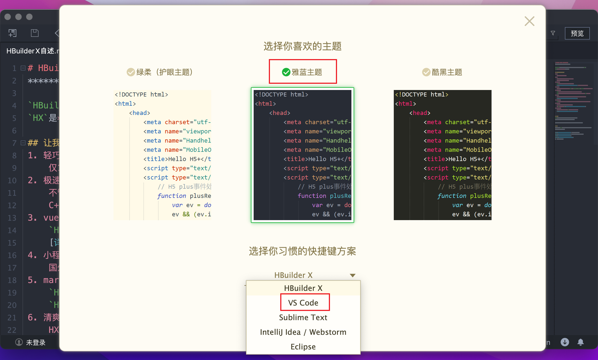

- HBuilder X 可视化界面创建项目

  如下图所示，在【菜单栏】 => 【文件】 => 【新建】 => 【项目】

  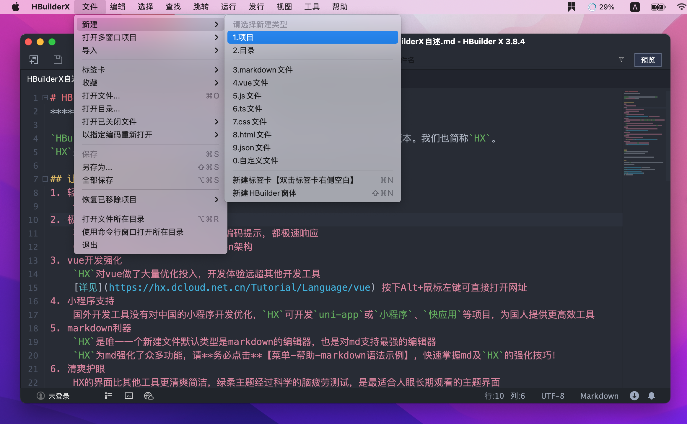

  在打开的窗口中配置项目的基本属性，如项目名称、项目位置、Vue 的版本等，如下图所示

  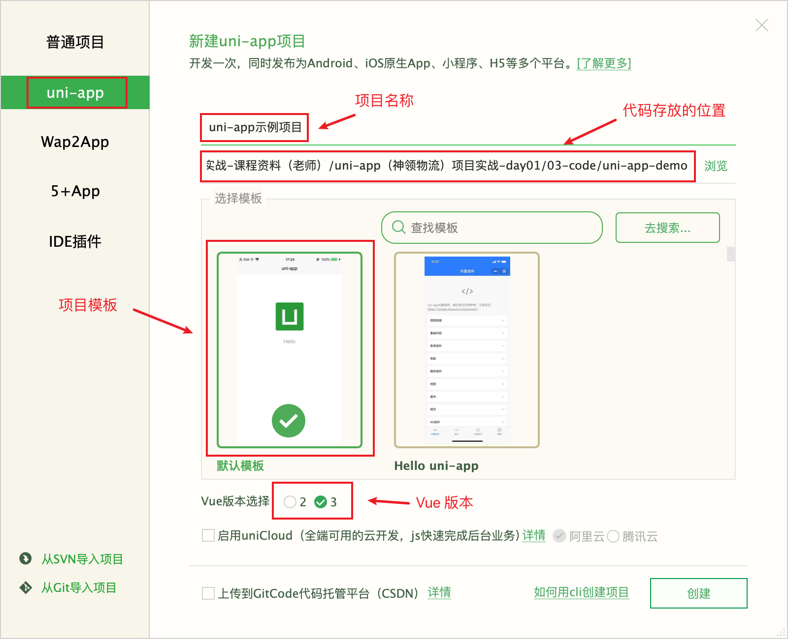

  至此我们便完成了 uni-app 项目的创建，如下图所示

  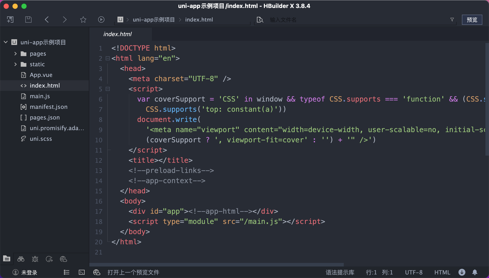

##### 1.1.2 vue-cli 方式

uni-app 是基于 Vue.js 开发的框架，如果采用 Vue2 的语法可以使用 `vue-cli` 来创建项目：

```bash
# vue-cli 创建 uni-app 项目
vue create -p dcloudio/uni-preset-vue my-project
```

如果采用 Vue3 的语法可以通过 `degit` 从 `github` 仓库下载项目模板方式创建项目：

```bash
# 下载 git 仓库中的项目模板
npx degit dcloudio/uni-preset-vue#vite my-vue3-project
```

以上是使用 cli 方式创建基于 Vue2 和 Vue3 项目的操作步骤，一般会使用 VS Code 做为开发工具，**这种方式创建的项目在 App 运行、调试、打包方面有所欠缺，因此如果要开发 App 的话，一般不采用该种方式。**


#### 1.2 项目运行

在创建的项目中可以看到 Vue 的单文件组件，即 uni-app 创建的项目本质上就是 Vue 的项目，代码逻辑的细节我暂时先不去分析，先来看看 uni-app 的项目是如何启动的。

在 HBuilder X 菜单栏中找到【运行】或者按快捷键 Ctrl + R（Command + R）

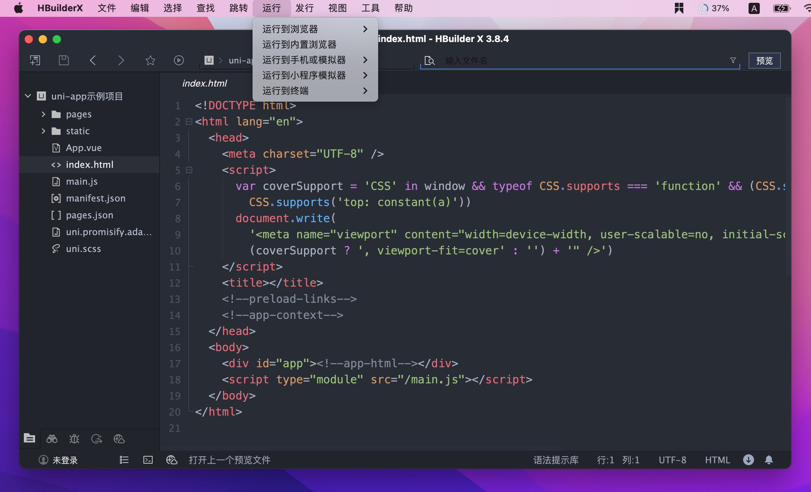

- 运行到浏览器，即将项目打包成了 H5 版本了
- 运行到小程序模拟器，即将项目打包成小程序了
- 运行到手机或模拟器，即将项目打包成 App了

**至此便不难理解何谓跨端开发了，就是通过编定一套代码，分别打包不同平台的应用。**

##### 1.2.1 H5端

H5 端运行有两种方式，一种是运行到浏览器，另一种是运行到内置浏览器，当选择内置浏览器时会提示安装【内置浏览器】插件。

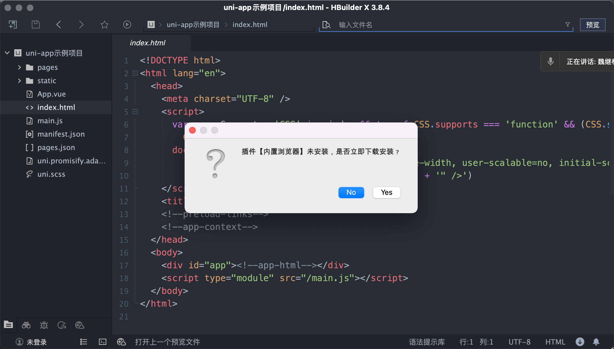


##### 1.2.2 小程序端

运行到小程序端里需要做两种事情，分别是设置小程序的【AppID】 和开启【服务端口】，以微信小程序为例：

- 设置 AppID

  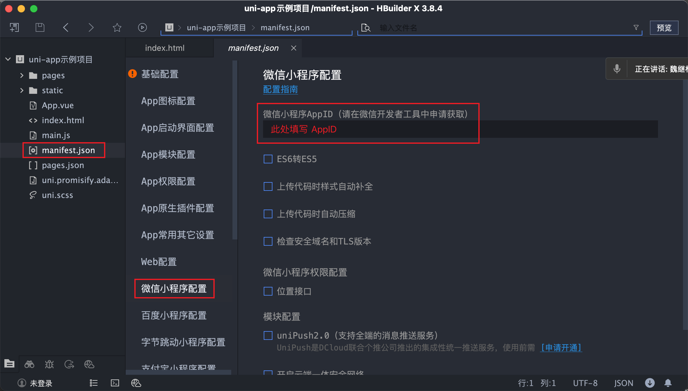

- 启用服务端口，目的是通过 HBuilder X 自动启动运行小程序开发者工具，启用服务端口的步骤如下：

  - 打开微信开发者工具（需要自行安装并登录）
  - 【菜单栏】 => 【设置】=> 【安全设置】

  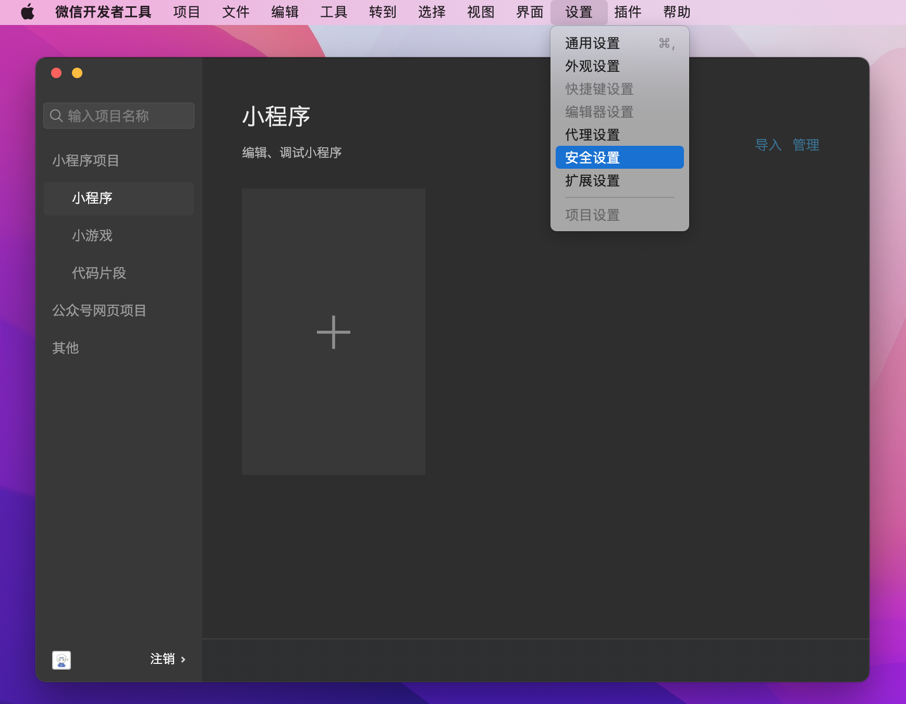

  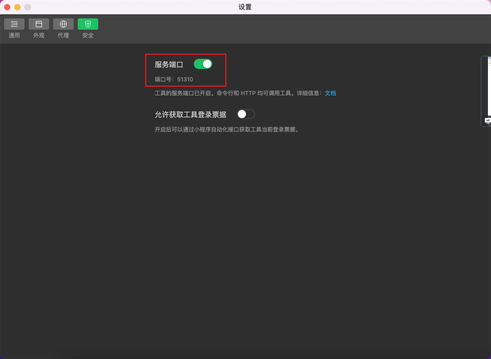


##### 1.2.3 App 端

运行到 App 端时需要先安装【真机运行插件】，如下图所示：


等待【真机运行插件】安装完毕后，再次打开【运行】=> 运行到手机或模拟器

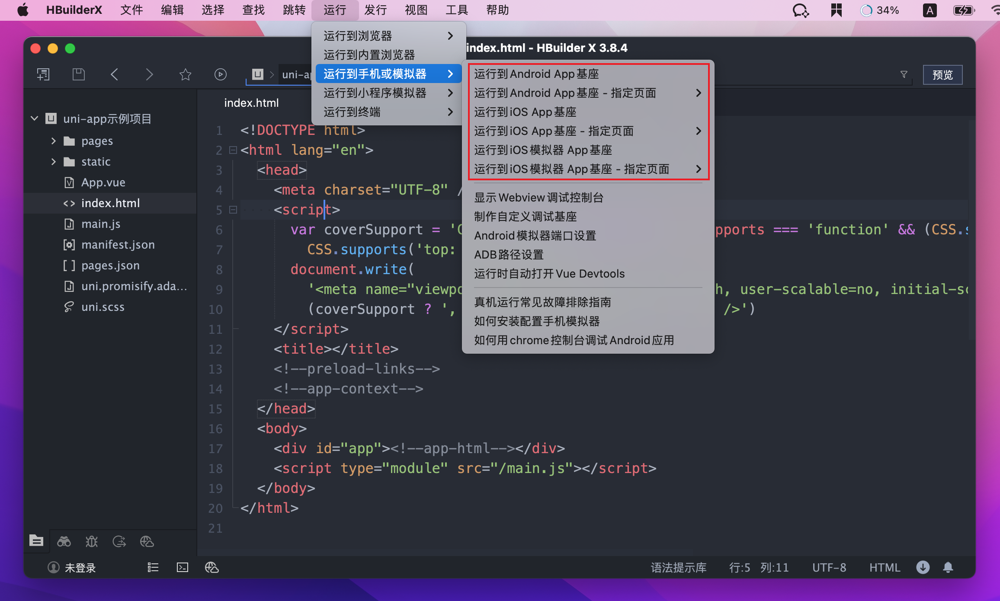

从上图中可以看到，运行到 App 时 Android 和 IOS 分别又分为运行到【真机】和【模拟器】

真机，顾名思义就是真实的 Android 和 iPhone 手机

模拟器，是在电脑上虚拟出来的手机环境，Android 需要安装 Android Studio，IOS 需要安装 Xcode

**选择【真机】还是【模拟器】呢？**

**Android 建议使用真机，IOS 建议使用模拟器**

======================================================================================

**开发 IOS 时只能在 Mac OS 平台下，Android 则在 Mac OS 和 Windows 下都可以**，基于这个情况咱们介绍一下如何将 uni-app 项目运行到 Android 真机上。

- 使用 USB 线连接电脑和 Android 手机
- 安装驱动程序（Mac OS 不用安装）
- 开启 USB 调试模式
  - 找到【系统设置】=>【系统】=> 【关于手机】=> 【版本号】
  - 连续点击版本号，直到提示【开启开发者模式】为止
  - 找到【系统设置】=>【系统】=> 【开发者选项】=> 【USB调试】，开启该选项

=======================================================================================

以上的步骤都是准备工作，接下来回到 HBuilder X 中，选择【运行】=>【运行到 Android App 基座】

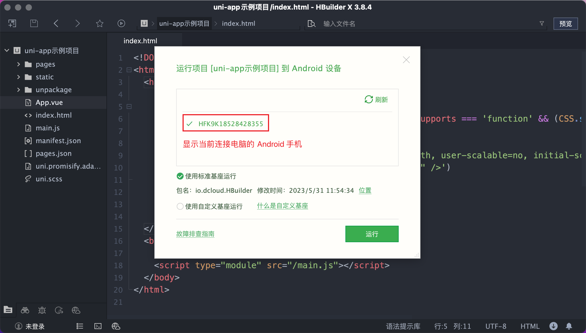

首次在 App 中运行时还会自动安装【uni-app（Vue3）编译器】，安装完毕后【重新运行】就可以在手机中运行 uni-app 项目了。


**没有 Android 手机怎么办？**

**可以第三方平台的【云手机】服务（一般都是付费的，但是有试用额度）**，推荐使用腾讯的 [WeTest](https://wetest.qq.com/products/cloud-phone)。


#### 1.3 Hbuilder X 插件

HBuilder X 的[插件市场](https://ext.dcloud.net.cn/)提供了大量的插件来提升项目开发的效率，刚刚在运行 uni-app 时就自动安装几个插件，本小节介绍一下 HBuilder X 插件的安装、管理以衣配置。

##### 1.3.1 注册账号

点击 HBuilder X 左下角的用户登录

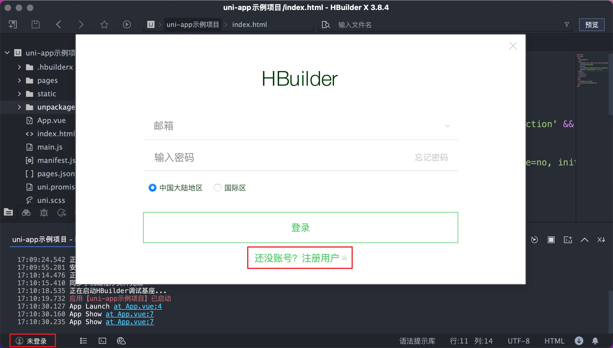

注册完账号后，再次回到这里来进行登录。

##### 1.3.2 插件市场

找到【菜单】=>【工具】=>【插件安装】，在新打开的窗口中可以看到当前已经安装的插件


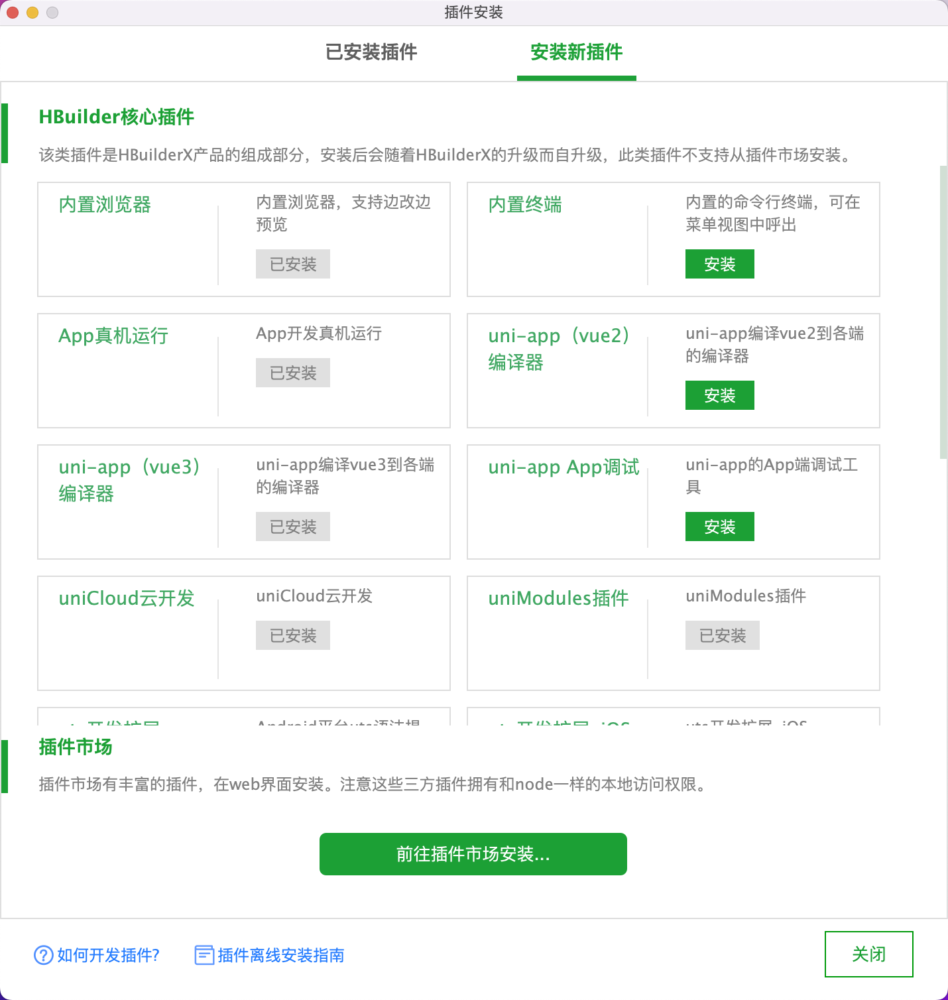

##### 1.3.3 安装插件

在插件市场通过搜索方式找到 Prettier 插件


点载下载插件并导入 HBuilder X 会自动打开 HBuilder X，并要求是否确认安装插件

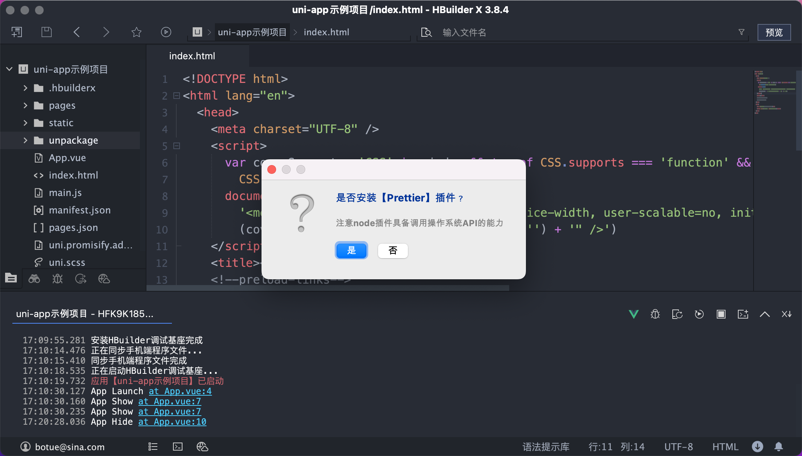

##### 1.3.4 管理/配置插件

打开 HBuilder X 的设置或使用快捷键 Ctrl + , (Command + ,)


安装了 Prettier 插件后默认为启用状态，需要大家补充的是自定义 Prettier 的生效文件范围，添加对 `.js` 文件的支持，接下来在项目的根目录中创建 `.prettierrc` 并添加如下配置：

```json
{
  "printWidth": 80,
  "tabWidth": 2,
  "useTabs": false,
  "semi": false,
  "singleQuote": true,
  "vueIndentScriptAndStyle": true,
}
```

##### 1.3.5 其它配置

除上插件相关配置外，大家还需要对 HBuilder X 本身的设置做一些调整，主要有以下几个方面：

- 项目管理器字体大小
- 编辑器字体大小
- 编辑字体（中文/英文）
- 制表符长度
- 空格代替制表符
- 保存时自动格式化
- 代码折叠时显示最后一行

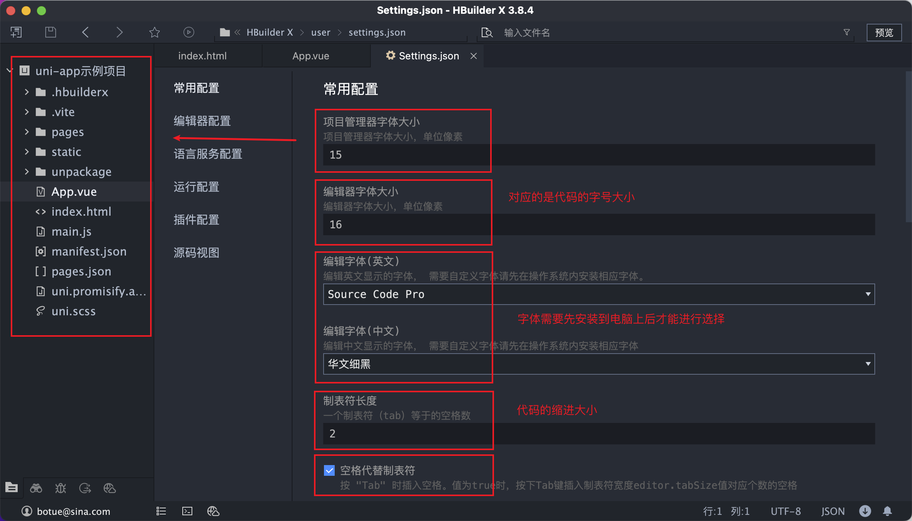

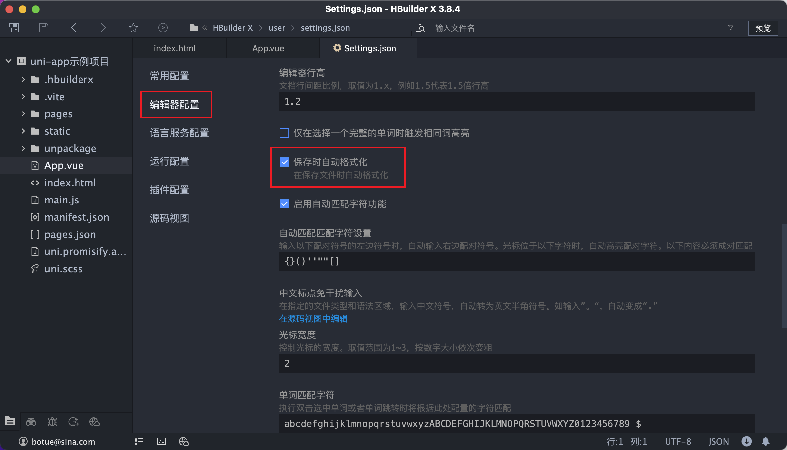

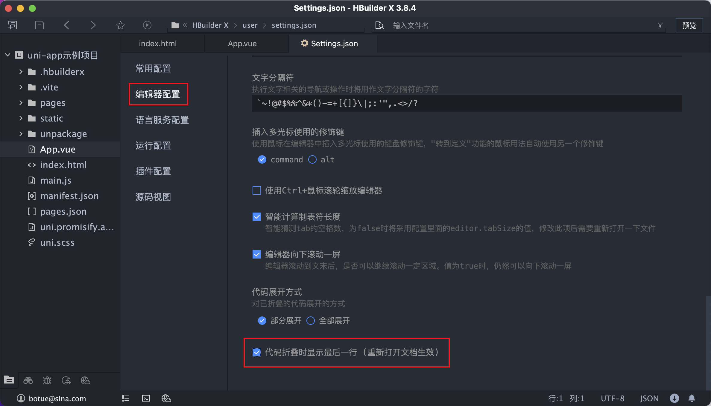

当配置了【保存自动格式】时，会自动的根据插件来进行代码格式化的处理，由于我们安装了 Prettier 插件，所以此时 HBuilder X 会提示我们是否要选择使用 Prettier 来格式化代码。

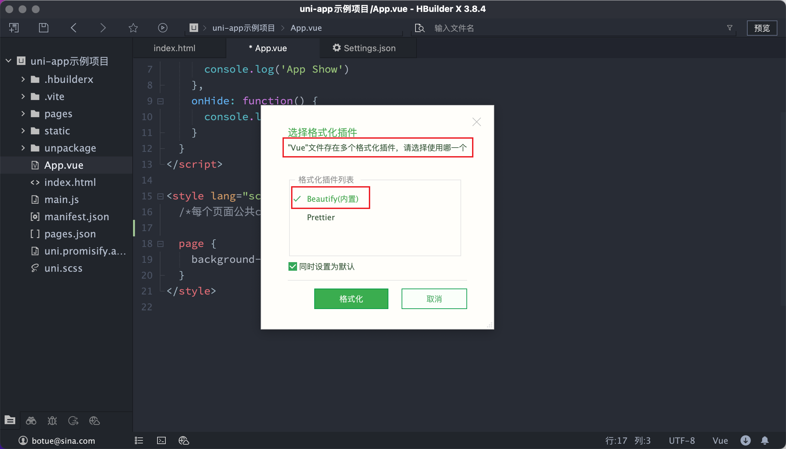

### 二、uni-app 基础知识

uni-app 是组合了 Vue 和微信小程序的相关技术知识，要求大家同时俱备 Vue 和原生小程序的开发基础。

#### 2.1 全局文件

在小程序中有全局样式、全局配置等全局性的设置，为此在 uni-app 中也有一些与之相对应的全局性的文件。

##### 2.1.1 uni.scss

uni-app 项目在运行时会自动将 `uni.scss` 会自动被注入到页面样式当中，根据这个特性可以在 `uni.scss` 中定义一些全局 SASS 变量，统一页面的样式风格，如主色调、边框圆角等。

```css
/* uni.scss */
/* 在原有 sass 变量基础上添加新的变量 */
$uni-bg-color: #f4f4f4;
```

##### 2.1.2 App.vue

App.vue 在 uni-app 中是一个特殊的文件

```html
<script>
  // 相当于小程序的 app.js
  export default {
    onLaunch: function () {
      console.log('App Launch')
    },
    onShow: function () {
      console.log('App Show')
    },
    onHide: function () {
      console.log('App Hide')
    },
  }
</script>

<!-- 组件模板需要被省略 -->
<template></template>
<!-- 组件模板需要被省略 -->

<style>
  /* 相当于 app.wxss */
  page {
    background-color: $uni-bg-color;
  }
</style>
```

- `template` 组件模板须要省略
- `script` 相当于小程序的 `app.js`
- `style` 相当于小程序的 `app.wxss`，为其指定 `lang="scss"` 属性后，会自动安装 `dart-sass` 插件


##### 2.1.3 pages.json

pages.json 文件即包含了小程序的【全局配置】也包含了【页面配置】：

```json
{
	"pages": [
		{
			"path": "pages/index/index",
			"style": {
				"navigationBarTitleText": "学习uni-app"
			}
		}
	],
	"globalStyle": {
		"navigationBarTextStyle": "black",
		"navigationBarTitleText": "uni-app",
		"navigationBarBackgroundColor": "#F8F8F8",
		"backgroundColor": "#F8F8F8"
	},
	"uniIdRouter": {}
}
```

上述是 pages.json 初始的代码，其中

- `pages` 对应的是【页面配置】，`path` 指定页面的路径，`style` 为该路径的相关配置，如背景色、导航栏等
- `globalStyle` 对应【全局配置】的 `window`，用来全局配置页面背景色、导航栏等

**那其它的全局配置如何定义呢？比如 `tabBar`、`subPackages`**

**答案是其它的【全局配置】与 `globalStyle` 平级就可以了**

===========================================

**重点：tabBar 的图片必须要放到 static 目录下，否则小程序中无法运行**

===========================================

先来看关于 `tabBar` 的配置：

```json
{
	"pages": [],
	"globalStyle": {},
  "tabBar": {
    "color": "",
    "selectedColor": "",
    "borderStyle": "",
    "position": "",
    "list": [
      {
        "text": "",
        "pagePath": "",
        "iconPath": "",
        "selectedIconPath": ""
      }
    ]
  },
	"uniIdRouter": {}
}
```

再来看 `subPackages` 的配置：

```json
{
	"pages": [],
	"globalStyle": {},
  "tabBar": {},
  "subPackages": [
    {
      "root": "",
      "pages": [
        {
          "path": "",
          "style": {
            
          }
        }
      ],
    }
  ],
	"uniIdRouter": {}
}
```

其它的【全局配置】，也都采用与 `globalStyle` 平级的方式来写就可以了。

#### 2.2 组件

在 uni-app 中组件分成内置组件和扩展组件。

##### 2.2.1 内置组件

uni-app 把微信小程序的内置组件都做了重新实现，保证能够在不同的平台表**现尽量一致**，因此在学习使用uni-app 的组件时，只需要参照微信小程序内置组件即可。

```xml
<view class="message">hello uni-app!</view>
<image src="" mode="" />
<swiper autoplay>
  <swiper-item>
  	<image src="" />
  </swiper-item>
  <swiper-item>
  	<image src="" />
  </swiper-item>
<swiper>
```

内置组件的使用与原生组件基本一致，这里就不过多的演示了。

##### 2.2.2 扩展组件

在 uni-app 中的扩展组件（uni ui）大多是一些业务性与交互性比较强的组件，比如倒计时组件、日历组件、文件上传等，扩展组件是需要[下载](https://ext.dcloud.net.cn/plugin?id=55)到项目录目录中才可以使用。

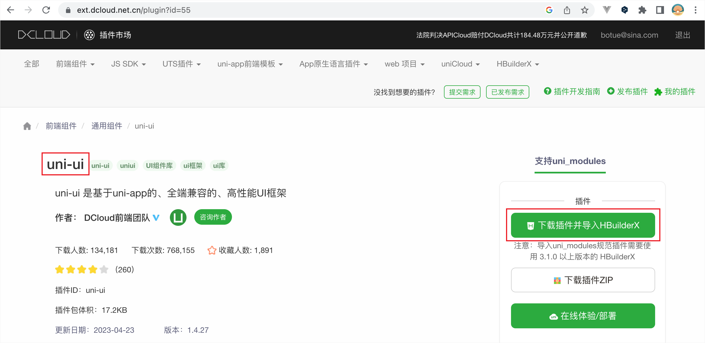

参照[文档](https://uniapp.dcloud.net.cn/component/uniui/uni-ui.html#)来使用相应的组件，插件市场也有许多第三方的优秀组件库，如 uView（不支持 Vue3）

##### 2.3 生命周期

在 uni-app 中生命周期也微信小程序一样也分成3个类别，分别是应用级生命周期、页面级生命周期和组件级生命周期，其支持情况可见下表：

<table>
  <thead>
    <tr>
      <th>类型</th>
      <th>名称</th>
      <th>应用是否可用</th>
      <th>页面是否可用</th>
      <th>组件是否可用</th>
    </tr>
  </thead>
  <tbody>
    <tr>
      <td rowspan="3">应用生命周期</td>
      <td>onLauch</td>
      <td>是</td>
      <td>否</td>
      <td>否</td>
    </tr>
    <tr>
      <td>onShow</td>
      <td>是</td>
      <td>否</td>
      <td>否</td>
    </tr>
    <tr>
      <td>onHide</td>
      <td>是</td>
      <td>否</td>
      <td>否</td>
    </tr>
    <tr>
      <td rowspan="4">页面生命周期</td>
      <td>onLoad</td>
      <td>否</td>
      <td>是</td>
      <td>否</td>
    </tr>
    <tr>
      <td>onShow</td>
      <td>否</td>
      <td>是</td>
      <td>否</td>
    </tr>
    <tr>
      <td>onHide</td>
      <td>否</td>
      <td>是</td>
      <td>否</td>
    </tr>
    <tr>
      <td>onReady</td>
      <td>否</td>
      <td>是</td>
      <td>否</td>
    </tr>
    <tr>
      <td rowspan="10">Vue生命周期</td>
      <td>beforeCreate</td>
      <td>是</td>
      <td>是</td>
      <td>是</td>
    </tr>
    <tr>
      <td>created</td>
      <td>是</td>
      <td>是</td>
      <td>是</td>
    </tr>
    <tr>
      <td>beforeMount</td>
      <td>是</td>
      <td>是</td>
      <td>是</td>
    </tr>
    <tr>
      <td>mounted</td>
      <td>是</td>
      <td>是</td>
      <td>是</td>
    </tr>
    <tr>
      <td>beforeUpdate</td>
      <td>是</td>
      <td>是</td>
      <td>是</td>
    </tr>
    <tr>
      <td>updated</td>
      <td>是</td>
      <td>是</td>
      <td>是</td>
    </tr>
    <tr>
      <td>activated</td>
      <td>仅H5</td>
      <td>仅H5</td>
      <td>仅H5</td>
    </tr>
    <tr>
      <td>deactivated</td>
      <td>仅H5</td>
      <td>仅H5</td>
      <td>仅H5</td>
    </tr>
    <tr>
      <td>beforeDestoryed</td>
      <td>是</td>
      <td>是</td>
      <td>是</td>
    </tr>
    <tr>
      <td>destoryed</td>
      <td>是</td>
      <td>是</td>
      <td>是</td>
    </tr>
  </tbody>
</table>

当然上表是不需要大家死记硬背的，大家记这样一个原则即可：

**【应用生命周期】和【页面生命周期】采用小程序的生命期，自定义【组件生命周期】使用 Vue 的生命周期。**

结合 Vue3 的 setup 语法使用【应用生命周期】和【页面生命周期】需要用到 `@dcloudio/uni-app` 包

```html
<script setup>
  // Vue 组件生命周期
  import { onMounted } from 'vue'
  // 应用/页面生命周期（小程序生命周期）
  import { onLaunch, onLoad } from '@dcloudio/uni-app'
  
  // ...
</script>
```

#### 2.4 API 调用

##### 2.4.1 命名空间

uni-app 把微信小程序绝大部分的 API 做了重新实现，使其尽量能在不同的平台（H5的限制比较多）中使用，所不同的是在调用这些 API 时，需要将命名空间换成 `uni`，举例来说明，原来的调用方法为 `wx.request` 在 uni-app 中则换成 `uni.request` 即可。

```html
<script setup>
  import { onLoad } from '@dcloudio/uni-app'
  
  // 页面加载后获取接口数据
  onLoad(() => {
    // 原来的 wx.request 换成 uni.request
    uni.request({
      url: '',
      success(result) {
        console.log(result)
      }
    })
  })
</script>
```

##### 2.4.2 Promise

在原生小程序中有部分的 API 是不支持 Promise 的，比如 `wx.request`、`wx.uploadFile` 等，在 uni-app 中对这些 API 的调用方法做了规订，使其即能支持 Promise 也可以支持 callback 方式，它是这样规定的：

1. 在调用 API 时，传入 `success`、`fail`、`complete` 任意回调函数，即为 callback 方式

```javascript
// 回调方式，不返回 Promise
uni.request({
  url: 'https://your.api.com/xxx',
  success: (result) => {
    console.log(result)
  }
})

// 如果在调用 API 时传入了 success fail complete 那么不会返回 Promise
```

2. 在调用 API 时，没有传入任意回调函数，即为 Promise 方式

```javascript
// Promise 方式
const result = uni.request({
  url: 'https://your.api.com/xxx'
})
// Promise 对象
console.log(result)
```

返回值为 Promise 时方便配置 async/wait 来获取结果。

#### 2.5 条件编译

uni-app 目标是通过编写一套代码，实现跨端的开发，但是不同的平台之间存在的差异也是事实，很难做到完全一套代码在各个平台都能够兼容，比如 `uni.login` 这个 API 在 H5 平台就无法被支持，再比如 `keep-alive` 只能用在 H5 端。

为了解决平台的差异性，特殊情况下需要为不同平台编写合适的代码，且要保证这些代码只在某个的平台下运行，uni-app 提供了[条件编译](https://uniapp.dcloud.net.cn/tutorial/platform.html#%E8%B7%A8%E7%AB%AF%E5%85%BC%E5%AE%B9)的技术解决方案。

##### 2.5.1 基本语法

条件编译是用**特殊的注释**作为标记，在编译时根据这些特殊的注释，将注释里面的代码编译到不同平台。

语法格式为：

```
#ifdef 平台名称 || 平台名称
特定平台要执行的代码
#endif

#ifndef 平台名称
除了特定平台之外其它平台要执行的代码
#endif
```

下面以 H5 平台来给大家演示具体的语法：

```html
<script setup>
  // #ifdef H5
  console.log('这段代码只在 H5 端才会运行')
  // #endif
</script>
<template>
  <!-- #ifdef H5 -->
  <view class="iconfont icon-search"></view>
  <!-- #endif -->
  
  <!-- #ifndef H5 -->
  <view class="iconfont icon-scan"></view>
  <!-- #endif -->
</template>
<style lang="scss" scoped>
  .iconfont {
    color: #666;
    font-size: 30rpx;
    /* #ifdef H5 */
    font-size: 28rpx;
    /* #endif */
  }
</style>
```

##### 2.5.2 平台名称

不同的不台对应了不同的名称，这些名称都是 uni-app 内置提供的，比如 H5、MP-WEIXIN、APP-PLUS 等

| 值          | 生效条件                      |
| ----------- | ----------------------------- |
| VUE3        | Vue 版本为 Vue3               |
| APP-PLUS    | App 平台，包括 Android 和 IOS |
| APP-ANDROID | Android 平台                  |
| APP-IOS     | IOS 平台                      |
| H5          | H5 平台                       |
| MP          | 小程序平台，包括所有小程序    |
| MP-WEIXIN   | 微信小程序                    |
| MP-ALIPAY   | 阿里小程序                    |


### 三、作业

