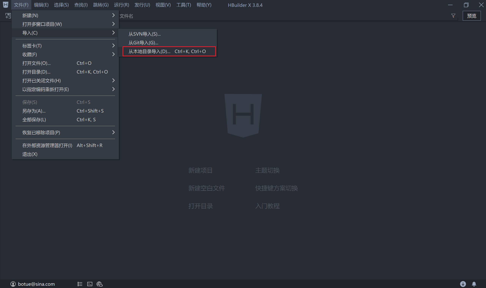

## uni-app（神领物流）项目实战 - 第2天


**学习目标：**

- 能够对 Pinia 进行初始化操作
- 掌握创建 Store 及数据操作的步骤
- 能够对 Pinia 数据进行持久化的处理
- 掌握 uniForm 表单验证的使用方法
- 能够根据业务需求配置请求/响应拦截器


### 一、【神领物流】项目启动

本节的主要任务是获取项目的静态页面、配置基本的网络请求和公共方法的封装。

#### 1.1 拉取代码

```bash
# 拉取仓库代码
git clone https://gitee.com/lotjol/shenling-driver.git
```

本阶段课程中不专门针对 Git 的内容进行讲解，因此大家可以选择将目录中的 `.git` 删除，也可以在删除 `.git` 目录，重新初始化仓库自行练习 Git 的使用。

拿到代码后打开 HBuilderX以导入的方式打开项目（也可以通过拖入的方式打开项目）：



关于该项目大家需要了解的是配置了 3 个分包:

- `subpkg_message` 对应消息的模板的内容
- `subpkg_task` 对应任务模块的内容
- `subpkg_user` 对应用户模块的内容

在 H5 端启动项目可以看到项目当前只是完成了静态页面部分的开发，数据接口与业务逻辑部分都尚未实现，这也是接下来我们即将学习的内容。

#### 1.2 公共封装

##### 1.2.1 网络请求

在 uni-app 中通过 `uni.request` 发起网络请求，在实际的应用中需要结合一些业务场景进行二次封装，比如配置 baseURL、拦截器等，社区有许多封装好的库，我们在项目中可以拿过来直接使用。

`uni-app-fetch` 是对 `uni.request` 的封装，通过 npm 来安装该模块

```bash
# 安装 uni-app-fetch 模块
npm install uni-app-fetch
```

然后根据自身的业务需求来配置 `uni-app-fetch`

```javascript
// apis/uni-fetch.js

// 导入安装好的 uni-app-fetch 模块
import { createUniFetch } from 'uni-app-fetch'

// 配置符合自身业务的请求对象
export const uniFetch = createUniFetch({
	loading: { title: '正在加载...' },
	baseURL: 'https://slwl-api.itheima.net',
	intercept: {
		// 请求拦截器
		request(options) {
			// 后续补充实际逻辑
      return options
		},
		// 响应拦截器
		response(result) {
			// 后续补充实际逻辑
      return result
		},
	},
})
```

`uni-app-fetch` 更详细的使用[文档](https://github.com/lotjol/uni-app-fetch#readme)在这里，它的使用逻辑是仿照 `axios` 来实现的，只是各别具体的用法稍有差异，在具体的应用中会给大家进行说明。

- loading 是否启动请求加载提示
- baseURL 配置请求接口的基地址
- intercept 配置请求和响应拦截器

配置完成后到项目首页（任务）测试是否请求能够发出，在测试时需要求【神领物流】全部接口都需要登录才能访问到数据，因此在测试请求时只要能发出请求即可，不关注返回结果是否有数据。

```vue
<!-- pages/task/index.vue -->
<script setup>
  // 导入根据业务需要封装好的网络请求模块
	import { uniFetch } from '@/apis/uni-fetch'
	// 不关注请求结果是否有数据
	uniFetch({
		url: '/driver/tasks/list',
	})
</script>
```

神领物流接口文档地址在[这里](https://apifox.com/apidoc/shared-4b036830-59b1-4526-b00a-61df2b3d4ae1)。

##### 1.2.2 轻提示

为了提升用户的体验，在项目的运行过程中需要给用户一些及时的反馈，比如数据验证错误、接口调用失败等，uni-app 中通过调用 `uni.showToast` 即可实现，但为了保证其使用的便捷性咱们也对它稍做封装处理。

```javascript
// utils/utils.js

/**
 * 项目中会用的一系列的工具方法
 */

export const utils = {
	/**
	 * 用户反馈（轻提示）
	 * @param {string} title 提示文字内容
	 * @param {string} icon 提示图标类型
	 */
	toast(title = '数据加载失败！', icon = 'none') {
		uni.showToast({
			title,
			icon,
			mask: true,
		})
	}
}

// 方便全局进行引用
uni.utils = utils
```

在项目入口 `main.js` 中导入封装好的工具模块

```javascript
// main.js
import App from './App'
import '@/utils/utils'

// 省略了其它部分代码...
```

到项目中测试工具方法是否可用，还是在首页面（task）中测试

```vue
// pages/task/index.vue
<script setup>
  // 导入根据业务需要封装好的网络请求模块
	import { uniFetch } from '@/apis/uni-fetch'
	// 不关注请求结果是否有数据
	uniFetch({
		url: '/driver/tasks/list'
	}).then((result) => {
    if(result.statusCode !== 200) uni.utils.toast()
  })
</script>
```

通过上述代码的演示我们还可以证实一个结论：`uni-app-fetch` 返加的是 Promise 对象，将来可配合 `async/await` 来使用。

### 二、【神领物流】用户登录

【神领物流】所有接口的调用都必须是登录状态才可以，因此我们要实现的第一个功能模块就是用户的登录。

#### 2.1 Pinia 状态管理

用户登录后需要将登录状态（token）信息记录下来，在 Vue2 的项目中使用 Vuex3 来实现，但是在 Vue3 的项目中需要使用 Vuex4 或者 Pinia 来实现。

[Pinia](https://pinia.vuejs.org/zh/) 是 Vue 专属于状态管理库，是 Vuex 状态管理工具的替代品，其具有一个特点：

- 提供了更简单的 API（去掉了 mutation）
- 提供组合式风格的 API
- 去掉了 modules 的概念，每一个 store 都是独立的模块
- 配合 TypeScript 更加友好，提供可靠的类型推断

##### 2.1.1 安装 Pinia

```bash
# 安装 pinia 到项目当中
npm install pinia
```

在这里大家需要注意一下，在 uni-app 中内置集成了 Pinia 的支持，因此可以省略掉安装这个步骤，但如果是在非 uni-app 的 Vue3 项目使用 Pinia 时必须要安装后再使用。

##### 2.1.2 Pinia 初始化

```javascript
// main.js
import { createSSRApp } from 'vue'
// 引入 Pinia
import { createPinia } from 'pinia'

import App from './App'
import '@/utils/utils'

export function createApp() {
  const app = createSSRApp(App)

  // 实例化Pinia
  const pinia = createPinia()
  // 传递给项目应用
  app.use(pinia)

  return { app }
}
```

##### 2.1.3 定义 Store

在 Vuex 中我们已经知道 了 `store` 本质上就是在【定义数据】及【处理数据】的方法，在 Pinia 中 `store` 也是用来【定义数据】和【处理数据】的方法的，所不同的是定义的方式不同。

- `ref()` 就是 `state`
- `computed` 就是 `getters`
- `function()` 就是 `actions`

```javascript
// stores/counter.js
import { defineStore } from 'pinia'
import { ref } from 'vue'

export const useCounterStore = defineStore('counter', () => {
  // 状态数据（相当于 state）
  const count = ref(0)
  // 定义方法（相当于 actions）
  function increment() {
    count.value++
  }

  function decrement() {
    count.value--
  }

  // 一定要将定义的数据和方法返回
  return { count, increment, decrement }
})
```

接下来将定义好的状态数据应用于 Vue 的组件中，只需要将将 Pinia 定义的 Store 当成普通模块来使用就可以了，详见下面代码：

```vue
<!-- pages/pinia/index.vue -->
<script setup>
  import { useCounterStore } from '@/stores/counter'
  // 获取 store 对象
  const store = useCounterStore()
</script>
<template>
  <view class="counter">
    <button @click="store.decrement" class="button" type="primary">-</button>
    <input class="input" v-model="store.count" type="text" />
    <button @click="store.increment" class="button" type="primary">+</button>
  </view>
</template>
```

2.1.4 storeToRefs 

使用 storeToRefs 函数可以辅助保持数据（state + getter）的响应式结构，**即对数据进行解构处理后仍然能保持响应式的特性。**

```vue
<!-- pages/pinia/index.vue -->
<script setup>
  import { storeToRefs } from 'pinia'
  import { useCounterStore } from '@/stores/counter'

  // 获取 store 对象
  const store = useCounterStore()
  const { count } = storeToRefs(store)
  const { increment, decrement } = store
</script>
<template>
  <view class="counter">
    <button @click="decrement" class="button" type="primary">-</button>
    <input class="input" v-model="count" type="text" />
    <button @click="increment" class="button" type="primary">+</button>
  </view>
</template>
```

##### 2.1.5 持久化

在实际的开发过程中有部分的业务数据需要长时间的保存，即所谓的持久化，例如标识用户登录状态的 `token` 通常需要长时间的保存起来，在 Pinia 中管理数据状态的同时要实现数据的持久化，需要引入`pinia-plugin-persistedstate` [插件](https://prazdevs.github.io/pinia-plugin-persistedstate/zh/)。

```bash
# 安装 pinia-plugin-persistedstate 插件
npm i pinia-plugin-persistedstate
```

分成3个步骤来使用 `pinia-plugin-persistedstate`

1. 将插件添加到 pinia 实例上

```javascript
// main.js
import { createSSRApp } from 'vue'
import { createPinia } from 'pinia'
import piniaPluginPersistedstate from 'pinia-plugin-persistedstate'

// 省略中间部分代码...

export function createApp() {
  const app = createSSRApp(App)
  
  // 实例化Pinia
  const pinia = createPinia()
  // Pinia 持久化插件
  pinia.use(piniaPluginPersistedstate)
	
  // 省略部分代码...
}
```

2. 配置需要持久化的数据，创建 Store 时，将 `persist` 选项设置为 `true`

```javascript
import { defineStore } from 'pinia'
import { ref } from 'vue'

export const useCounterStore = defineStore('counter', () => {
  // 状态数据（相当于 state）
  const count = ref(0)
  
	// 省略部分代码...

  // 一定要将定义的数据和方法返回
  return { count, increment, decrement }
}, {
  persist: {
    paths: ['count'],
  }
})
```

当把 `persist` 设置为 `true` 表示当前 Store 中全部数据都会被持久化处理， 除此之外还可以通过 `paths` 来特别指定要持久化的数据。

3.  自定义存储方法（针对 uni-app的处理）

小程序中和H5中实现本地存储的方法不同，为了解决这个问题需要自定义本地存储的逻辑。

```javascript
// stores/persist.js
import { createPersistedState } from 'pinia-plugin-persistedstate'
export const piniaPluginPersistedstate = createPersistedState({
  key: (id) => `__persisted__${id}`,
  storage: {
    getItem: (key) => {
      return uni.getStorageSync(key)
    },
    setItem: (key, value) => {
      uni.setStorageSync(key, value)
    },
  },
})
```

使用 uni-app 的 API `uni.getStorageSync` 和 `uni.setStorageSync` 能够同时兼容 H5、小程序以及 App，**然后需要调整原来在 `main.js` 中的部分代码**

```javascript
// main.js
import { createSSRApp } from 'vue'
import { createPinia } from 'pinia'
// import piniaPluginPersistedstate from 'pinia-plugin-persistedstate'
import { piniaPluginPersistedstate } from '@/stores/persist'

// 省略中间部分代码...

export function createApp() {
  const app = createSSRApp(App)
  
  // 实例化Pinia
  const pinia = createPinia()
  // Pinia 持久化插件
  pinia.use(piniaPluginPersistedstate)
	
  // 省略部分代码...
}
```

#### 2.2 uniForm 表单验证

通常在提交表数据时需要对用户填写的内容进行校验，在 uni-app 的扩展组件中提供了关于[表单数据验证](https://zh.uniapp.dcloud.io/component/uniui/uni-forms.html#%E4%BB%8B%E7%BB%8D)的功能，我们来学习一下它的使用步骤：

##### 2.2.1 表单数据

定义表单的数据，指定 `v-model` 获取用户的数据

```vue
<!-- pages/login/components/account.vue -->
<script setup>
  import { ref, reactive } from 'vue'
  
  // 表单数据
  const formData = reactive({
    account: '',
    password: '',
  })
</script>
<template>
  <uni-forms class="login-form" :model="formData">
    <uni-forms-item name="account">
      <input
        type="text"
        v-model="formData.account"
        placeholder="请输入账号"
        class="uni-input-input"
        placeholder-style="color: #818181"
      />
    </uni-forms-item>
    ...
  </uni-forms>
</template>
```

##### 2.2.2 验证规则

uni-app 的表单验证功能需要单独定义验证的规则：

```vue
<!-- pages/login/components/account.vue -->
<script setup>
  import { ref, reactive } from 'vue'
  
  // 表单数据
  const formData = reactive({
    account: '',
    password: '',
  })
  
  // 定义表单数据验证规则
  const accountRules = reactive({
    account: {
      rules: [
        { required: true, errorMessage: '请输入登录账号' },
        { pattern: '^[a-zA-Z0-9]{6,8}$', errorMessage: '登录账号格式不正确' },
      ],
    },
    password: {
      rules: [
        { required: true, errorMessage: '请输入登录密码' },
        { pattern: '^\\d{6}$', errorMessage: '登录密码格式不正确' },
      ],
    },
  })
</script>
<template>
  <uni-forms class="login-form" :rules="accountRules" :model="formData">
    <uni-forms-item name="account">
      <input
        type="text"
        v-model="formData.account"
        placeholder="请输入账号"
        class="uni-input-input"
        placeholder-style="color: #818181"
      />
    </uni-forms-item>
    ...
  </uni-forms>
</template>
```

在定义 `accountRules` 时，对象中的 `key` 对应的是待验证的数据项目，如 `account` 表示要验证表单数据 `account`，`rules` 用来指验证的条件和错误信息提示。

##### 2.2.3 触发验证

调用 `validate` 方法触发表单验单

```vue
<!-- pages/login/components/account.vue -->
<script setup>
  import { ref, reactive } from 'vue'
  
 	// 表单元素的 ref 属性
  const accountForm = ref()
  
  // 表单数据
  const formData = reactive({
    account: '',
    password: '',
  })
  
  // 定义表单数据验证规则
  const accountRules = reactive({
    account: {
      rules: [
        { required: true, errorMessage: '请输入登录账号' },
        { pattern: '^[a-zA-Z0-9]{6,8}$', errorMessage: '登录账号格式不正确' },
      ],
    },
    password: {
      rules: [
        { required: true, errorMessage: '请输入登录密码' },
        { pattern: '^\\d{6}$', errorMessage: '登录密码格式不正确' },
      ],
    },
  })
  
  // 监听表单的提交
  async function onFormSubmit() {
    try {
      // 验证通过
      const formData = await accountForm.value.validate()
      // 表单的数据
      console.log(formData)
    } catch (err) {
      // 验证失败
      console.log(err)
    }
  }
</script>
<template>
  <uni-forms
    class="login-form"
    ref="accountForm"
    :rules="accountRules"
    :model="formData"
  >
    <uni-forms-item name="account">
      <input
        type="text"
        v-model="formData.account"
        placeholder="请输入账号"
        class="uni-input-input"
        placeholder-style="color: #818181"
      />
    </uni-forms-item>
    ...
    <button @click="onFormSubmit" class="submit-button">登录</button>
  </uni-forms>
</template>
```

#### 2.3 登录实现

完整的登录功能包含也以下几个小的步骤，我们一步一步来实现。

##### 2.3.1 调用接口

在验证用户数据通过后就可以调用接口来完成登录的操作了，登录接口的文档地址在[这里](https://apifox.com/apidoc/shared-4b036830-59b1-4526-b00a-61df2b3d4ae1/api-71252494)。

为了方便接口调用的管理和维护我们将接口调用的逻辑封到独立的模块中

```javascript
// apis/user.js
// 引入网络请求模块
import { uniFetch } from './uni-fetch'
export default {
  /**
   * @param {Object} data 用户账号和用户密码
   */
  login(data) {
    if (!data.account || !data.password) return
    // 根据接口文档来调用接口
    return uniFetch.post('/driver/login/account', data)
  }
}
```

接下来就可以在用户点击登录时调用模块中封装好的 `login` 方法了

```vue
<!-- pages/login/components/account.vue -->
<script setup>
  import { ref, reactive } from 'vue'
  import userApi from '@/apis/user'
  
  // 中间部分代码省略了...
  
  async function onFormSubmit() {
    try {
      // 验证表单数据且通过
      const formData = await accountForm.value.validate()
      // 调用登录接口
      const { code } = await userApi.login(formData)
      // 记录用户登录成功后的状态
    } catch (err) {
      // 验证失败
      console.log(err)
    }
  }
</script>
```

##### 2.3.2 拦截器

用户登录成功后，再次调用其它的接口时就需要将登录状态通过自定义请求头的方式传递给接口服务器了，这个功能我们通过请求拦截器来实现，分成两个步骤来实现：

1. 通过 Pinia 来记录并持久化 `token`

```javascript
// stores/users.js
import { defineStore } from 'pinia'
import { ref } from 'vue'

export const useUserStore = defineStore('user', () => {
  // 登录状态
  const token = ref('')
  // 更新登录状态
  function setToken(token) {
    token.value = token
  }
  return { token, setToken }
}, {
  persist: {
    paths: ['token'],
  },
})
```

上述代码中定义了与用户（user）相关的 Store，并定义了数据 `token`，用来记录用户的登录状态。

接下来在调用登录接口成功后 `token` 通过 Pinia 存储起来

```vue
<!-- pages/login/components/account.vue -->
<script setup>
  import { ref, reactive } from 'vue'
  import userApi from '@/apis/user'
  import { useUserStore } from '@/stores/user'
  const userStore = useUserStore()
  
  // 中间部分代码省略了...
  
  async function onFormSubmit() {
    try {
      // 验证表单数据且通过
      const formData = await accountForm.value.validate()
      // 调用登录接口
      const { code } = await userApi.login(formData)
      
      // 检测接口是否调用成功
      if (code !== 200) return uni.utils.toast('登录失败，请重试！')
      // 持久化存储用户登录状态
      userStore.token = data
      
    } catch (err) {
      // 验证失败
      console.log(err)
    }
  }
</script>
```

2. 配置请求拦截器

登录成功后，当再次调用其它接口里需要将用户的登录状态以自定义头信息的方式发送到服务端，配置请求拦截器来实此功能。

```javascript
// apis/uni-fetch.js
// 导入安装好的 uni-app-fetch 模块
import { createUniFetch } from 'uni-app-fetch'
import { useUserStore } from '@/stores/user'

// 配置符合自身业务的请求对象
export const uniFetch = createUniFetch({
  loading: { title: '正在加载...' },
  baseURL: 'https://slwl-api.itheima.net',
  intercept: {
    // 请求拦截器
    request(options) {
      const userState = useUserStore()
      // 全局公共头信息
      const defaultHeaders = {
        Authorization: userState.token,
      }
      // 自定义头信息（token）
      options.header = Object.assign({}, defaultHeaders, options.header, )

      return options
    },
    // 响应拦截器
    response({ data }) {
      // 过滤多余的数据
      return data
    },
  },
})
```

回到首页面（task）当中，之前测试过任务列表接口的调用，现在给它传必须的参数 `status`、`page`、`pageSize` 然后可以看到接口能返回数据了，原因就在于自定义头信息 `Authorization` 携带了用户的登录状态 `token`，也就证明了咱们关于请求拦截器的配置生效了。

```vue
<!-- pages/task/index.vue -->
<script>
  import { ref } from 'vue'
  import { uniFetch } from '@/apis/uni-fetch'

  uniFetch({
    url: '/driver/tasks/list',
    // 传入该接口必要的参数
    data: { status: 1, page: 1, pageSize: 10 },
  }).then((result) => {
    if (result.statusCode) uni.utils.toast()
  })
</script>
```

##### 2.3.3 地址重定向

与登录相关的重定向有两个方面，一是用户登录成功后需要到跳转到新页面，另一个是当检测到用户的 `token` 失效后跳转到登录页生新进行登录，因此我们分成两个步骤来学习。**注：当前项目的 `token` 12个小时后会失效。**

1. 在响应拦截器检测请求响应的状态码是否为 `401` ，状态码 `401` 表示当前 `token` 失效了，需要重新登录

```javascript
// apis/uni-fetch.js
// 导入安装好的 uni-app-fetch 模块
import { createUniFetch } from 'uni-app-fetch'
import { useUserStore } from '@/stores/user'
// 定义 tabBar 的路径
const tabBarPagePaths = [
  'pages/task/index',
  'pages/message/index',
  'pages/my/index'
]

// 配置符合自身业务的请求对象
export const uniFetch = createUniFetch({
  loading: { title: '正在加载...' },
  baseURL: 'https://slwl-api.itheima.net',
  intercept: {
    // 请求拦截器
    request(options) {
  		// 省略中间部分代码...
      return options
    },
    // 响应拦截器
    response({ statusCode, data }) {
      // 页面栈
      const pageStack = getCurrentPages()
      // 当前页面地址
      const redirectURL = pageStack[pageStack.length - 1].route
			// tabBar 页面需要使用 switchTab 跳转
      const routeType = tabBarPagePaths.includes(redirectURL)
        ? 'switchTab'
        : 'redirectTo'

      if (statusCode === 401) {
        return uni.redirectTo({
          url: `/pages/login/index?routeType=${routeType}&redirectURL=/${redirectURL}`,
        })
      }
      
      return data
    },
  },
})
```

上述代码需重点需要注意判断调用接口的页面是否为 tabBar 的页面，目的是下个步骤登录成功后能够成功的回跳到当前这个页面中，tabBar 的页面使用 `uni.switchTab` 跳转，否则使用 `wx.redirectTo` 跳转。

2. 当用户登录成功能跳回来原来的页面

```vue
<!-- pages/login/components/account.vue -->
<script setup>
  import { ref, reactive } from 'vue'
  import { onLoad } from '@dcloudio/uni-app'
	
  // 省略中间部分代码

  // 回跳地址
  const redirectURL = ref('')
  // 跳转地址方式
  const routeType = ref('')

  // 获取地址中的参数
  onLoad((query) => {
    redirectURL.value = query.redirectURL
    routeType.value = query.routeType
  })

  // 监听表单提交
  async function onFormSubmit() {
    try {
			// 省略部分代码...
      
      // 地址重定向或switchTab
      uni[routeType.value]({ url: redirectURL.value })
    } catch (err) {
      // 验证失败
      console.log(err)
    }
  }
</script>
```

### 三、【神领物流】我的

我的模块中有 3 个独立的接口调用，需要大家自已来完成。

#### 3.1 个人信息查询

个人信息查询即在【我的】页面中展示当前登录司机的个人信息，包括头像、名称、编号。

接口文档的说明在[这里](https://apifox.com/apidoc/shared-4b036830-59b1-4526-b00a-61df2b3d4ae1/api-71325815)，分成 2 个步骤来实现：

1. 定义接口调用的方法，在 `apis/user.js` 中新增获取司机信息的接口

```javascript
// apis/user.js
// 引入网络请求模块
import { uniFetch } from './uni-fetch'

export default {
	// 省略中间部分代码...
  /**
   * 个人资料
   */
  profile() {
    return uniFetch.get('/driver/users')
  },
}
```

2. 在【我的】页面中获取数据并渲染

```vue
<!-- pages/my/index.vue -->
<script setup>
  import { ref } from 'vue'
  import { onLoad } from '@dcloudio/uni-app'
  import userApi from '@/apis/user'

  // 用户信息
  const userProfile = ref({})

  onLoad(() => {
    getUserProfile()
  })

  // 用户信息接口
  async function getUserProfile() {
    try {
      const { code, data } = await userApi.profile()
      // 检测接口否调用成功
      if (code !== 200) return uni.$utils.toast()
      // 渲染请求来的数据
      userProfile.value = data
    } catch (err) {
      console.log(err)
    }
  }
</script>

<template>
  <view class="page-container">
    <view class="user-profile">
      <image class="avatar" :src="userProfile.avatar" mode=""></image>
      <text class="username">{{ userProfile.name }}</text>
      <text class="no">司机编号：{{ userProfile.phone }}</text>
      <text class="mobile">手机号码：{{ userProfile.number }}</text>
    </view>
 		...
  </view>
</template>
```

#### 3.2 任务数据查询

任务数据查询也是在在【我的】页面中进行展示，展示的内容包括3项，分别是任务总量、完成任务量、运输时程。**注：这些数据初始为 0 ，后续开发完【任务】模块后这里的数据会发生更新。**

接口文档的说明在[这里](https://apifox.com/apidoc/shared-4b036830-59b1-4526-b00a-61df2b3d4ae1/api-71327680)，分成 2 个步骤来实现：

1. 定义接口调用的方法，在 `apis/user.js` 中新增获取任务数据的接口

```javascript
// apis/user.js
// 引入网络请求模块
import { uniFetch } from './uni-fetch'

export default {
	// 省略中间部分代码...
  /**
   * 任务数据
   * @param {string} year - 任务数据的年份
   * @param {string} month - 任务数据的月份
   */
  task(year, month) {
    return uniFetch.get('/driver/users/taskReport', { year, month })
  },
}
```

2. 在【我的】页面中获取数据并渲染

```vue
<!-- pages/my/index.vue -->
<script setup>
  import { ref } from 'vue'
  import { onLoad } from '@dcloudio/uni-app'
  import userApi from '@/apis/user'

  // 用户信息
  const userProfile = ref({})
  // 任务数据
  const taskInfo = ref({})

  onLoad(() => {
    getUserProfile()
    getTaskInfo()
  })

  // 用户信息接口
  async function getUserProfile() {
    try {
      const { code, data } = await userApi.profile()
      // 检测接口否调用成功
      if (code !== 200) return uni.$utils.toast()
      // 渲染请求来的数据
      userProfile.value = data
    } catch (err) {
      console.log(err)
    }
  }
  
  // 任务数据
  async function getTaskInfo() {
    try {
      const { code, data } = await userApi.task('2023', '07')
      // 检测接口否调用成功
      if (code !== 200) return uni.$utils.toast()
      // 渲染请求来的数据
      taskInfo.value = data
    } catch (err) {
      console.log(err)
    }
  }
</script>

<template>
  <view class="page-container">
    ...
    <view class="month-overview">
      <view class="title">本月任务</view>
      <view class="content">
        <view class="item">
          <text class="volumn">{{ taskInfo.taskAmounts }}</text>
          <text class="label">任务总量</text>
        </view>
        <view class="item">
          <text class="volumn">{{ taskInfo.completedAmounts }}</text>
          <text class="label">完成任务量</text>
        </view>
        <view class="item">
          <text class="volumn">{{ taskInfo.transportMileage }}</text>
          <text class="label">运输里程(km)</text>
        </view>
      </view>
    </view>
    ...
  </view>
</template>
```

#### 3.3 车辆信息查询

查询当前司机所驾驶车辆的相关信息，展示的内容包括车辆照片、车牌号、车型等信息。

接口文档的说明在[这里](https://apifox.com/apidoc/shared-4b036830-59b1-4526-b00a-61df2b3d4ae1/api-71329158)，分成两个步骤来实现：

1. 定义接口调用的方法，在 `apis/user.js` 中新增获取车辆信息的接口

```javascript
// apis/user.js
// 引入网络请求模块
import { uniFetch } from './uni-fetch'

export default {
	// 省略中间部分代码...
  /**
   * 车辆信息
   */
  truck() {
    return uniFetch.get('/driver/users/truck')
  },
}
```

2. 在【车辆信息】页面中获取数据并渲染

```vue
<!-- subpkg_user/truck/index.vue -->
<script setup>
  import { ref } from 'vue'
  import { onLoad } from '@dcloudio/uni-app'
  import userApi from '@/apis/user'

  // 车辆信息
  const truchInfo = ref({})

  onLoad(() => {
    getTruckInfo()
  })

  // 获取车辆信息
  async function getTruckInfo() {
    try {
      const { code, data } = await userApi.truck()
      // 检测接口否调用成功
      if (code !== 200) return uni.$utils.toast()
      // 渲染请求来的数据
      truchInfo.value = data
    } catch (err) {
      console.log(err)
    }
  }
</script>

<template>
  <view class="page-container">
    <swiper
      class="truck-pictures"
      indicator-active-color="#fff"
      circular
      indicator-dots
    >
      <swiper-item v-for="picture in truchInfo.pictureList" :key="picture.url">
        <image class="picture" mode="aspectFill" :src="picture.url"></image>
      </swiper-item>
    </swiper>
    <view class="truck-meta">
      <uni-list :border="false">
        <uni-list-item
          :border="false"
          title="车辆编号"
          :right-text="truchInfo.id"
        />
        <uni-list-item
          :border="false"
          title="车辆号牌"
          :right-text="truchInfo.licensePlate"
        />
        <uni-list-item
          :border="false"
          title="车型"
          :right-text="truchInfo.truckType"
        />
        <uni-list-item
          :border="false"
          title="所属机构"
          :right-text="truchInfo.currentOrganName"
        />
        <uni-list-item
          :border="false"
          title="载重"
          :right-text="truchInfo.allowableLoad"
        />
      </uni-list>
    </view>
  </view>
</template>
```


### 四、作业

独立完成第3章节3个接口的调用


