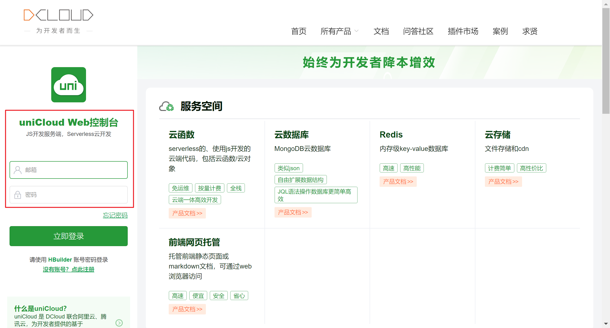
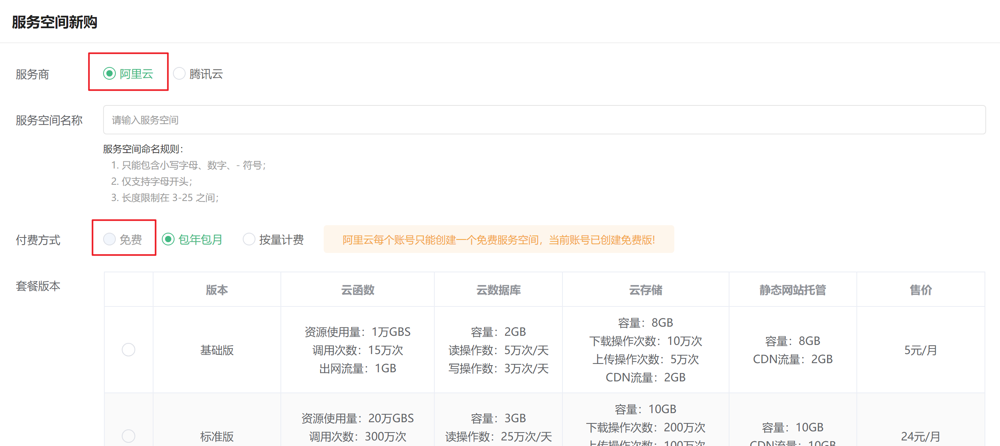
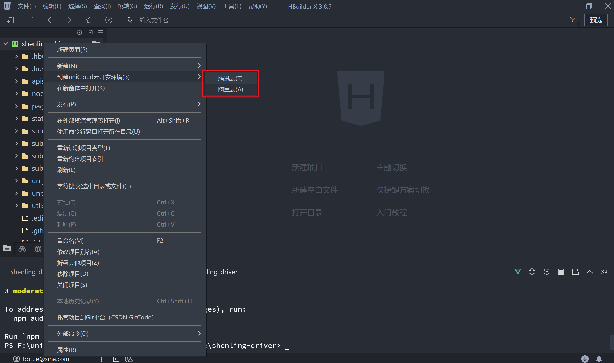
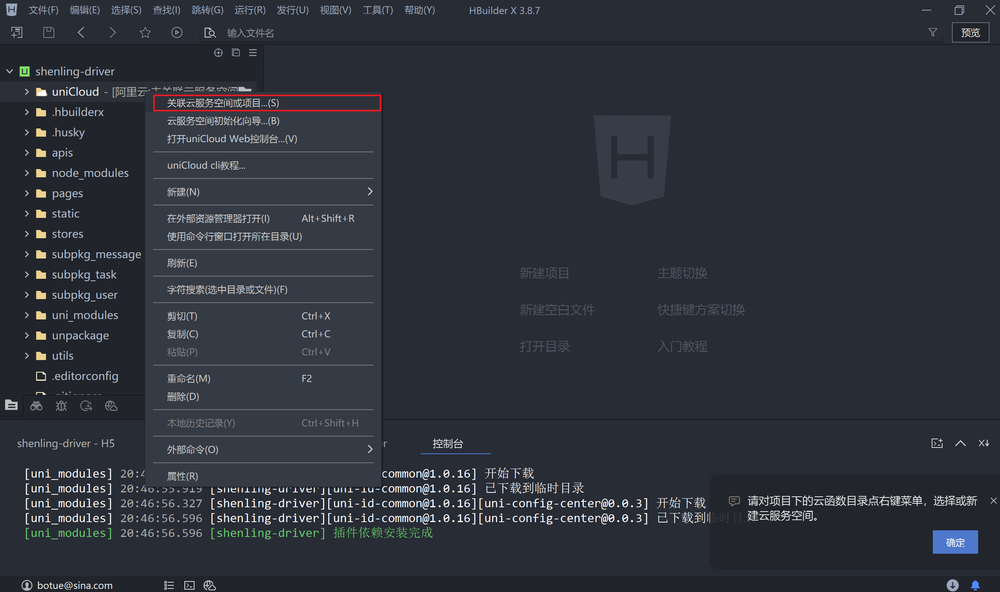
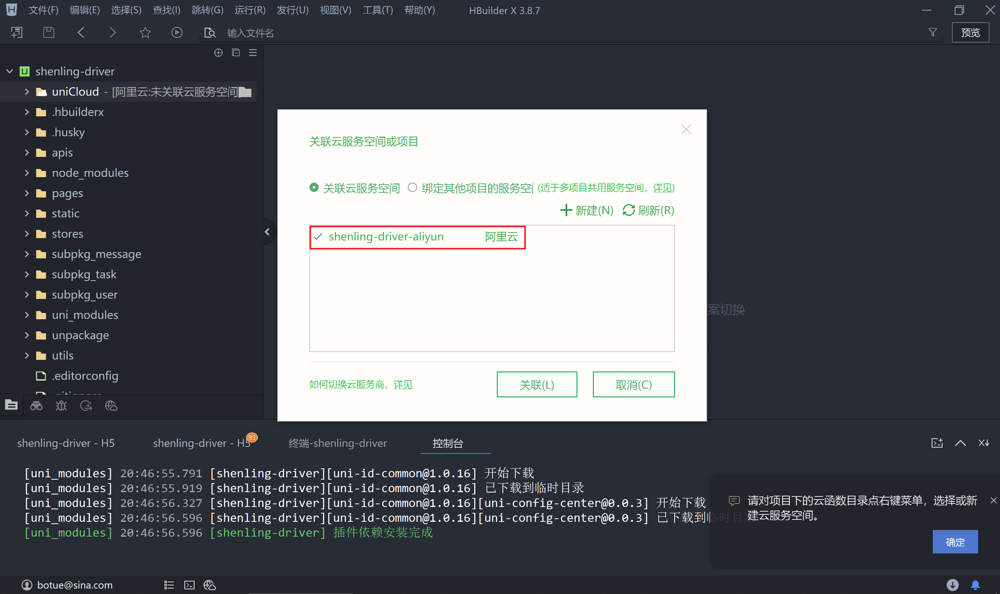
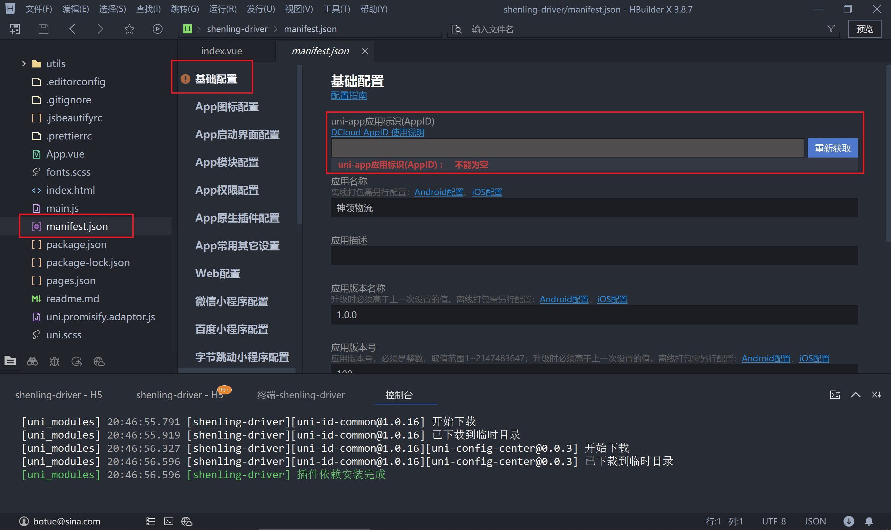
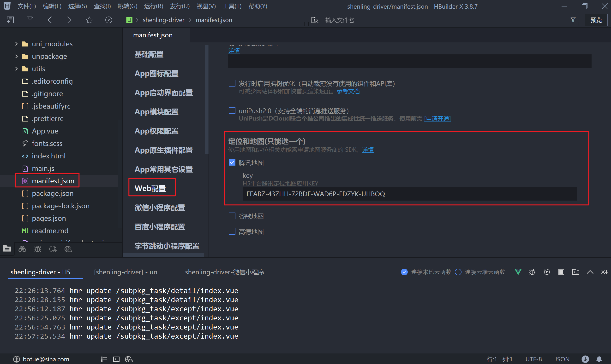
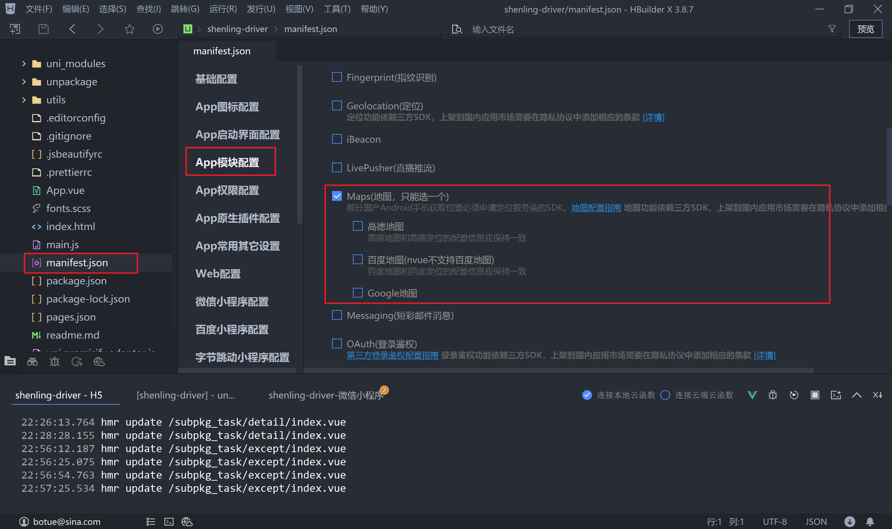
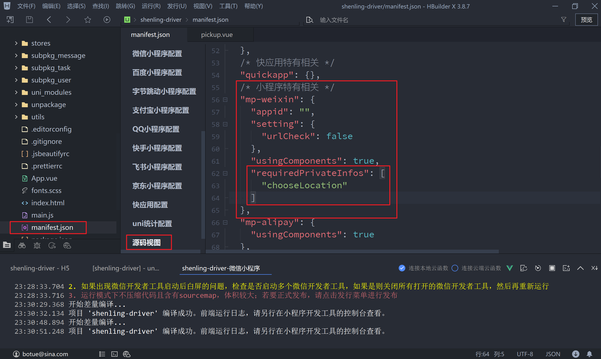

## uni-app（神领物流）项目实战 - 第4天


**学习目标：**

- 能够独立完成任务提货、异常上报、在途的功能

- 能够使用 uniCloud 实现上传文件到云存储的功能

- 能够配置地图服务平台的 Key 获取地址理位置

- 能够使用 uni-file-picker 和 uni-popup 扩展组件

  

### 一、【神领物流】任务

继续来开发任务模块剩下的其它功能。

#### 1.1 延迟提货

在司机接收到运输任务后，可以根据自身的情况调整去现场提货的时间，但是要提交申请并说明延迟提货的原因，即延迟提货的功能。

##### 1.1.1 获取参数

延迟提货的操作入口在【任务详情】页面当中，在跳转到延迟提货页面时地址携带的参数为当前【任务的 ID】 和【原计划提货的时间】。

```vue
<!-- pages/subpkg_task/detail.vue -->
<script setup>
  // ...
</script>
<template>
	<view class="page-container">
    ...
    <view class="toolbar" v-if="taskDetail.status === 1">
      <navigator
        :url="`/subpkg_task/delay/index?id=${taskDetail.id}&planDepartureTime=${taskDetail.planDepartureTime}`"
        hover-class="none"
        class="button secondary"
      >
        延迟提货
      </navigator>
      <navigator
        :url="`/subpkg_task/pickup/index?id=${taskDetail.id}`"
        hover-class="none"
        class="button primary"
      >
        提货
      </navigator>
    </view>
  </view>
</template>
```

接下来到延迟提货页面获取地址中传递的参数

 ```vue
 <!-- subpkg_task/delay/index.vue -->
 <script setup>
   import { ref } from 'vue'
   import { onLoad } from '@dcloudio/uni-app'
 
   // 原计划提货时间
   const planDepartureTime = ref('')
   // 延迟提货任务的ID
   const id = ref('')
 
   // 获取地址上的参数
   onLoad((query) => {
     // 原计划提货时间
     planDepartureTime.value = query.planDepartureTime
     // 延迟提货任务的ID
     id.value = query.id
   })
 </script>
 
 <template>
 
 </template>
 ```


##### 1.1.2 表单数据

表单数据有两个，分别为【延迟时间】和【延迟的原因】

1. 延迟时间

用户在填写延迟时间时用到是内置组件 `picker` 将其 `mode` 属性指定为 `time`，用户进行选择后会触发 `change` 事件，监听该事件即可得到用户选择的时间。

```vue
<!-- subpkg_task/delay/index.vue -->
<script setup>
  import { ref } from 'vue'
  import { onLoad } from '@dcloudio/uni-app'

  // 省略中间部分代码...
  
  // 延迟提货时间
  const delayTime = ref('')

 	// 省略中间部分代码...

  // 监听用户选择时间
  function onPickerChange(ev) {
    // 延迟提货时间，需要拼接日期
    const [date] = planDepartureTime.value.split(' ')
    delayTime.value = `${date} ${ev.detail.value}`
  }
</script>
<template>
  <view class="page-container">
			...
      <uni-list-item title="延迟时间" showArrow>
        <template v-slot:footer>
          <picker @change="onPickerChange" class="time-picker" mode="time">
            <text v-if="!delayTime">不可超过2个小时</text>
            <text v-else>{{ delayTime + ':00' }}</text>
          </picker>
        </template>
      </uni-list-item>
			...
  </view>
</template>
```

在上述代码中需要注意时间的拼凑方式：

- 日期部分要与原计划提货日期对应，原因在于只能延迟提货2个小时，所以必然在同一天当中

  

2. 延迟原因

直接使用 `v-model` 来获取即可，除了获取数据还需要对字数进行统计

```vue
<!-- subpkg_task/delay/index.vue -->
<script setup>
  import { ref } from 'vue'
  import { onLoad } from '@dcloudio/uni-app'

  // 省略中间部分代码...
  
  // 延迟原因
  const delayReason = ref('')

 	// 省略中间部分代码...

</script>

<template>
  <view class="page-container">
    	...
      <uni-list-item direction="column">
        <template v-slot:body>
          <view class="textarea-wrapper">
            <textarea
              class="textarea"
              v-model="delayReason"
              placeholder-style="color: #818181"
              placeholder="请输入延迟提货原因"
            ></textarea>
            <text class="words-count">0/50</text>
          </view>
        </template>
      </uni-list-item>
      ...
  </view>
</template>
```

通过计算属性来统计延迟原因的字数

```vue
<!-- subpkg_task/delay/index.vue -->
<script setup>
  import { ref, computed } from 'vue'
  import { onLoad } from '@dcloudio/uni-app'

  // 省略中间部分代码...
  
  // 延迟原因
  const delayReason = ref('')
  // 统计输入的字数
  const wordsCount = computed(() => delayReason.value.length)

 	// 省略中间部分代码...

</script>

<template>
  <view class="page-container">
    	...
      <uni-list-item direction="column">
        <template v-slot:body>
          <view class="textarea-wrapper">
            <textarea
              class="textarea"
              v-model="delayReason"
              placeholder-style="color: #818181"
              placeholder="请输入延迟提货原因"
            ></textarea>
            <text class="words-count">{{ wordsCount }}/50</text>
          </view>
        </template>
      </uni-list-item>
      ...
  </view>
</template>
```


3. 数据验证

通过计算属性来验证填写的数据是否符合要求，延迟时不允许超过原计划时间2个小时，延迟原因不超过50个字。

```vue
<!-- subpkg_task/delay/index.vue -->
<script setup>
  import { ref, computed } from 'vue'
  import { onLoad } from '@dcloudio/uni-app'

  // 省略中间部分代码...
  
  // 延迟提货时间
  const delayTime = ref('')
  // 验证延迟时间
  const delayTimeValid = computed(() => {
    // 延迟时间不超过2小时
    const start = new Date(planDepartureTime.value)
    const end = new Date(delayTime.value)
    // 时间差区间在 0 ~ 7200 * 1000 毫秒
    return end - start > 0 && end - start < 7200 * 1000
  })

  // 延迟原因
  const delayReason = ref('')
  // 统计输入的字数
  const wordsCount = computed(() => delayReason.value.length)
  // 验证延迟原因
  const delayReasonValid = computed(() => {
    return wordsCount.value <= 50 && wordsCount.value > 0
  })

 	// 省略中间部分代码...

</script>

<template>
  <view class="page-container">
    	...
      <uni-list-item title="延迟时间" showArrow>
        <template v-slot:footer>
          <picker @change="onPickerChange" class="time-picker" mode="time">
            <text v-if="!delayTime">不可超过2个小时</text>
            <text :class="{ error: !delayTimeValid }">{{ delayTime + ':00' }}</text>
          </picker>
        </template>
      </uni-list-item>
      <uni-list-item direction="column">
        <template v-slot:body>
          <view class="textarea-wrapper">
            <textarea
              class="textarea"
              v-model="delayReason"
              placeholder-style="color: #818181"
              placeholder="请输入延迟提货原因"
            ></textarea>
            <text :class="{ error: wordsCount > 50 }" class="words-count">
              {{ wordsCount }}/50
            </text>
          </view>
        </template>
      </uni-list-item>
      ...
  </view>
</template>
```


##### 1.1.3 提交数据

接下来需要调用接口来提交表单数据，接口文档的详细说明在[这里](https://apifox.com/apidoc/shared-4b036830-59b1-4526-b00a-61df2b3d4ae1/api-71276847)。

1. 禁用/开启表单提交，如果表单验证未通过时不允许用户点击按钮来提交表单

```vue
<!-- subpkg_task/delay/index.vue -->
<script setup>
  import { ref, computed } from 'vue'
  import { onLoad } from '@dcloudio/uni-app'

  // 省略中间部分代码...

  // 是否允许提交表单
  const enableSubmit = computed(() => {
    return !delayReasonValid.value || !delayTimeValid.value
  })

 	// 省略中间部分代码...

</script>

<template>
  <view class="page-container">
    	...
      <uni-list-item :border="false">
        <template v-slot:body>
          <button :disabled="enableSubmit" class="button">提交</button>
        </template>
      </uni-list-item>
      ...
  </view>
</template>
```

2. 封装调用接口的方法

```javascript
// apis/task.js
export default {
  // 省略中间部分代码...
  
  /**
   * 延迟提货
   * @param {Object} data - 接口参数
   */
  delay(data) {
    if(!data.id) return
    return uniFetch.put('/driver/tasks/delay', data);
  },
}
```

3. 调用接口提交数据

```vue
<!-- subpkg_task/delay/index.vue -->
<script setup>
  import { ref, computed } from 'vue'
  import { onLoad } from '@dcloudio/uni-app'
  import taskApi from '@/apis/task'

  // 省略中间部分代码...

  async function onSubmitForm() {
    // 待提交的表单数据
    const formData = {
      id: id.value,
      delayTime: delayTime.value,
      delayReason: delayReason.value,
    }
    const { code } = await taskApi.delay(formData)
    // 检测接口是否调用成功
    if (code !== 200) return uni.utils.toast('提交数据失败，稍后重试！')
    // 跳转到任务列表
    uni.reLaunch({ url: '/pages/task/index' })
  }
</script>

<template>
  <view class="page-container">
    	...
      <uni-list-item :border="false">
        <template v-slot:body>
          <button @click="onSubmitForm" :disabled="enableSubmit" class="button">
            提交
          </button>
        </template>
      </uni-list-item>
      ...
  </view>
</template>
```


#### 1.2 提货

司机到现场提货完成后需要上传相关的单据和现场货品的照片，即本小节要实现的功能，在本节上传图片会用到 uniCloud 提供的[云开发](https://unicloud.dcloud.net.cn/pages/login/login?uniIdRedirectUrl=%252Fpages%252Findex%252Findex)服务。

uni-app 提供了文件上传的[扩展组件](https://zh.uniapp.dcloud.io/component/uniui/uni-file-picker.html) `uni-file-picker`，通过该组件可以轻松的将图片上传到云空间，在使用 `uni-file-picker` 组件之前先来开通免费的云空间。

##### 1.2.1 uniCloud

1. 使用注册前面课程中注册好的账号来登录 uniCloud 的控制台



2. 新建服务空间



3. 新建 uniCloud 开发环境



4. 关联服务空间





5. 获取 AppID



6. 重新启动项目，**！！！非常重要！！！**


##### 1.2.2 uni-file-picker

`uni-file-picker` 是 uni-app 的扩展组件，用于实现文件上传的功能。

```vue
<!-- subpkg_task/pickup/index.vue -->
<script setup>
  import { ref } from 'vue'

	// "https://mp-664d2554-cfa5-4427-9adf-d14025991d5f.cdn.bspapp.com/cloudstorage/40edf9ed-9f29-48b7-ab29-425abe351dea.jpg"
  
  // 提货凭证图片
  const receiptPictrues = ref([])
  // 货品图片
  const goodsPictrues = ref([])

</script>
<template>
  <view class="page-container">
    <view class="receipt-info">
      <uni-file-picker
        v-model="receiptPictrues"
        file-extname="jpg,webp,gif,png"
        limit="3"
        title="请拍照上传回单凭证"
      ></uni-file-picker>
      <uni-file-picker
        file-extname="jpg,webp,gif,png"
        limit="3"
        title="请拍照上传货品照片"
      ></uni-file-picker>
    </view>
    <button disabled class="button">提交</button>
  </view>
</template>
```

- `title` 属性定义标题用于提示上传文件的内容
- `limit` 限制上传文件的数量
- `file-extname` 限制上传文件的类型
- `v-model` 用于回显上传的图片
- `@success` 上传成功的回调（了解即可）
- `@fail` 上传失败的回调（了解即可）

##### 1.2.3 数据验证

每种类型的图片最少1张，最多3张图片，通过计算属性来进行验证。

```vue
<!-- subpkg_task/pickup/index.vue -->
<script setup>
  import { ref, computed } from 'vue'
	
  // 省略中间部分代码...
  
  // 数据验证
  const enableSubmit = computed(() => {
    return goodsPictrues.value.length > 0 && receiptPictrues.value.length > 0
  })
</script>
<template>
  <view class="page-container">
    ...
    <button :disabled="!enableSubmit" class="button">提交</button>
  </view>
</template>
```

##### 1.2.4 提交表单

将上传到云空间的图片地址发送给后端接口，详细接口说明[文档在这里](https://apifox.com/apidoc/shared-4b036830-59b1-4526-b00a-61df2b3d4ae1/api-71297181)。

1. 准备表单数据

- 任务ID是通地址参数传递的
- `cargoPickUpPictureList` 数组只包含 `url` 属性
- `cargoPictureList` 数组只包含 `url` 属性

```vue
<!-- subpkg_task/pickup/index.vue -->
<script setup>
  import { ref, computed } from 'vue'
  import { onLoad } from '@dcloudio/uni-app'
	
  // 任务ID
  const id = ref('')
  // 提货凭证图片
  const receiptPictrues = ref([])
  // 数据二次处理，只保留 url 属性
  const cargoPickUpPictureList = computed(() => {
    return receiptPictrues.value.map(({ url }) => {
      return { url }
    })
  })

  // 货品图片
  const goodsPictrues = ref([])
  // 数据二次处理，只保留 url 属性
  const cargoPictureList = computed(() => {
    return goodsPictrues.value.map(({ url }) => {
      return { url }
    })
  })
  
  onLoad((query) => {
    // 获取任务ID
    id.value = query.id
  })
  
	// 省略中间部分代码...
  
</script>
<template>
  <view class="page-container">
    ...
    <button :disabled="!enableSubmit" class="button">提交</button>
  </view>
</template>
```

2. 封装接口调用接口的方法

```javascript
// apis/task.js
export default {
  // 省略中间部分代码...
  
  /**
   * 提货
   * @property {Object} data - 接口参数
   */
  pickup(data) {
    if (!data.id) return
    return uniFetch.post('/driver/tasks/takeDelivery', data);
  },
}
```

3. 到页面中调用接品提交表单数据

```vue
<!-- subpkg_task/pickup/index.vue -->
<script setup>
  import { ref, computed } from 'vue'
  import { onLoad } from '@dcloudio/uni-app'
	import taskApi from '@/apis/task'
    
	// 省略中间部分代码...

  // 提交表单数据
  async function onSubmitForm() {
    // 表单数据
    const formData = {
      id: id.value,
      cargoPickUpPictureList: cargoPickUpPictureList.value,
      cargoPictureList: cargoPictureList.value,
    }
    const { code } = await taskApi.pickup(formData)
    if (code !== 200) return uni.utils.toast('提交数据失败！')
    // 去到任务列表
    uni.reLaunch({ url: '/subpkg_task/detail/index?id=' + id.value })
  }
</script>
<template>
  <view class="page-container">
    ...
    <button @click="onSubmitForm" :disabled="!enableSubmit" class="button">提交</button>
  </view>
</template>
```


#### 1.3 在途

司机完成提货后，运输的任务状态即 `status` 的值会变成 2，获取在途列表的数据时所使用的接口与待提货是相同的，区别是传入的状态值有差异。

##### 1.3.1 任务列表

```vue
<!-- pages/task/components/delivery.vue -->
<script setup>
  import { ref, onMounted } from 'vue'
  import taskApi from '@/apis/task'

  // 在途任务列表
  const deliveryList = ref([])
  // 在途列任务列表是否为空
  const isEmpty = ref(false)

  // 生命周期（获取数据）
  onMounted(() => {
    getDeliveryList()
  })

  // 在途任务列表
  async function getDeliveryList() {
    const { code, data } = await taskApi.list(2)
    if (code !== 200) return uni.utils.toast('在途任务获取失败！')
    // 渲染数据
    deliveryList.value = data.items || []
    isEmpty.value = deliveryList.value.length === 0
  }
</script>
<template>
  <scroll-view scroll-y class="scroll-view">
    <view class="scroll-view-wrapper">
      <view
        v-for="delivery in deliveryList"
        :key="delivery.id"
        class="task-card"
      >
        <navigator
          hover-class="none"
          :url="`/subpkg_task/detail/index?id=${delivery.id}`"
        >
          <view class="header">
            <text class="no">任务编号: {{ delivery.transportTaskId }}</text>
          </view>
          <view class="body">
            <view class="timeline">
              <view class="line">{{ delivery.startAddress }}</view>
              <view class="line">{{ delivery.endAddress }}</view>
            </view>
          </view>
        </navigator>
        <view class="footer">
          <view class="label">到货时间</view>
          <view class="time">{{ delivery.planArrivalTime }}</view>
          <navigator
            hover-class="none"
            :url="`/subpkg_task/delivery/index?id=${delivery.id}`"
            class="action"
          >
            交付
          </navigator>

        </view>
      </view>
      <view v-if="isEmpty" class="task-blank">无在途货物</view>
    </view>
  </scroll-view>
</template>
```

##### 1.3.2 任务详情

当任务状态处于在途时，已经完成了提货的操作，因此在详情面面需要展示提货时提交的照片。

```vue
<!-- subpkg_task/detail/index.vue -->
<script setup>
  // 
</script>
<template>
  <view class="page-container">
		...
    <scroll-view scroll-y class="task-detail">
      <view class="scroll-view-wrapper">
				...
        <view v-if="taskDetail.status >= 2" class="panel pickup-info">
          <view class="panel-title">提货信息</view>
          <view class="label">提货凭证</view>
          <view class="pictures">
            <image
              v-for="receipt in taskDetail.cargoPictureList"
              :key="receipt.url"
              class="picture"
              :src="receipt.url"
            />
          </view>
          <view class="label">货品照片</view>
          <view class="pictures">
            <image
              v-for="goods in taskDetail.cargoPickUpPictureList"
              :key="goods.url"
              class="picture"
              :src="goods.url"
            />
          </view>
        </view>
				...
      </view>
    </scroll-view>
		...
  </view>
</template>
```

任务详情中的数据：

- `cargoPictureList` 提供凭证的照片
- `cargoPickUpPictureList` 提货商品的照片


#### 1.4 异常上报

异常上报是指司机在运输途中遇到的一些突发状况，这些突发状可能会导致运输到达时间有所延迟，司机需要将遇到的突发情况及时上报，方便管理端进行管理。

异常上报功能模块中包含交互相对要多一些，略为复杂一些，大家一定要耐心。

##### 1.4.1 异常时间

异常时间的获取用到了 uni-app 的扩展组件 `uni-datetime-picker` 和 `uni-list` 

- `v-model` 获取用户选择的时间
- `v-slot:footer` 插槽用于自定义 `uni-list-item` 右侧展示的内容

```vue
<!-- subpkg_task/except/index.vue -->
<script setup>
  import { ref, computed } from 'vue'
  
  // 省略了中间部分代码...
  
  // 获取异常时间
  const exceptionTime = computed(() => {
    return timePicker.value || '请选择'
  })
  // 扩展组件时间初始值
  const timePicker = ref('')
  
</script>
<template>
  <view class="page-container">
    <scroll-view class="scroll-view" scroll-y>
      <view class="scroll-view-wrapper">
        <uni-list :border="false">
          <uni-list-item show-arrow title="异常时间">
            <template v-slot:footer>
              <uni-datetime-picker v-model="timePicker">
                <view class="picker-value">{{ exceptionTime }}</view>
              </uni-datetime-picker>
            </template>
          </uni-list-item>
					...
        </uni-list>
      </view>
    </scroll-view>
    ...
  </view>
</template>
```


##### 1.4.2 上报位置

上报位置需要调用 `wx.chooseLocation` 来获取用户所在位置信息，在 uni-app 中调用 `wx.chooseLocation` 时需要指定地图服务平台申请的 key，并且地图的使用存在一定的兼容性。

| 地图服务商 | App        | H5   | 小程序 |
| ---------- | ---------- | ---- | ------ |
| 高德       | √          | √    |        |
| Google     | 仅nvue页面 | √    |        |
| 腾讯       |            | √    | √      |

对比后我们选择腾讯位置服务平台，之前在享+生活中介绍过如何创建应用以及申请 key，这里文档就不再缀述了。





注：支持 App 端需要指定其它地图服务商，在课堂就不演示其注册的流程了，大家可自行注册并申请 key。

另外微信小程序要求在使用 `wx.chooseLocation` 位置接口时必须要通过 `requiredPrivateInfos ` 进行配置，在 uni-app 中[设置 `requiredPrivateInfos` 需要](https://zh.uniapp.dcloud.io/collocation/manifest.html#mp-weixin)在 `manifest.json` 的源码视图中完成。



以上均是相关的配置准备工作，目的是保证 `uni.chooseLocation` 能够成功调用

```vue
<!-- subpkg_task/except/index.vue -->
<script setup>
  import { ref, computed } from 'vue'
  
  // 省略中间部分代码...
  
  // 上报位置数据
  const exceptionPlace = ref('')
  // 打开地图，选择位置
  async function onLocationChoose() {
    try {
      // 获取位置
      const { address } = await uni.chooseLocation({})
      exceptionPlace.value = address
    } catch (err) {}
  }
  
  // 省略中间部分代码...
</script>
<template>
  <view class="page-container">
    <scroll-view class="scroll-view" scroll-y>
      <view class="scroll-view-wrapper">
        <uni-list :border="false">
          ...
					<uni-list-item
            show-arrow
            clickable
            ellipsis="1"
            @click="onLocationChoose"
            title="上报位置"
            :right-text="exceptionPlace || '请选择'"
          />
        </uni-list>
      </view>
    </scroll-view>
    ...
  </view>
</template>
```


##### 1.4.3 异常类型

异常类型使用到了uni-app的[扩展组件](https://uniapp.dcloud.net.cn/component/uniui/uni-popup.html) `uni-popup`。

1. 在实现相关逻辑之前先来整理下 `uni-popup` 所展示的数据

```vue
<!-- subpkg_task/except/index.vue -->
<script setup>
  import { ref, computed, reactive } from 'vue'
  
  // 省略中间部分代码...
  
    // 定义 popup 组件展示的数据
  const exceptionTypes = reactive([
    '发动机启动困难',
    '不着车，漏油',
    '照明失灵',
    '排烟异常、温度异常',
    '其他问题',
  ])
  
  // 省略中间部分代码...
  
</script>

<template>
  <view class="page-container">
    ...
    <uni-popup ref="popup" type="bottom">
      <uni-list class="popup-action-sheet">
        ...
        <uni-list-item
          v-for="exceptionType in exceptionTypes"
          :key="exceptionType"
          :title="exceptionType"
        >
          <template v-slot:footer>
            <checkbox-group class="checkbox">
              <checkbox :value="exceptionType" color="#EF4F3F" />
            </checkbox-group>
          </template>
        </uni-list-item>
        ...
      </uni-list>
    </uni-popup>
  </view>
</template>
```

2. 选择并获取异常的类型，允许多选，选项之间使用 `|` 拼接

在用户选择了 `checkbox` 内置组件后会触发 `change` 事件，进而获取所选择的内容，由于允许多选所以先将用户选择的异常类型存一个临时数组中，当用户在点击确定时再将这个临时数组使用 `|` 拼凑成一个字符串。

- 将用户选择的异常类型存入数组，注意 `change` 事件要监听在 `checkbox-group` 组件上

```vue
<!-- subpkg_task/except/index.vue -->
<script setup>
  import { ref, computed } from 'vue'
  
  // 省略中间部分代码...
  
    // 定义 popup 组件展示的数据
  const exceptionTypes = reactive([
    '发动机启动困难',
    '不着车，漏油',
    '照明失灵',
    '排烟异常、温度异常',
    '其他问题',
  ])
  
  // 临时记录异常类型选项（可以不必是响应式）
  const tempException = []
  // 监听用户的选择操作
  function onCheckboxChange(ev) {
    // 将用户选择的异常类型存储到数组中
    tempException.push(ev.detail.value)
  }
  
  // 省略中间部分代码...
  
</script>

<template>
  <view class="page-container">
    ...
    <uni-popup ref="popup" type="bottom">
      <uni-list class="popup-action-sheet">
        ...
        <uni-list-item
          v-for="exceptionType in exceptionTypes"
          :key="exceptionType"
          :title="exceptionType"
        >
          <template v-slot:footer>
            <checkbox-group @change="onCheckboxChange" class="checkbox">
              <checkbox :value="exceptionType" color="#EF4F3F" />
            </checkbox-group>
          </template>
        </uni-list-item>
        ...
      </uni-list>
    </uni-popup>
  </view>
</template>
```

- 在用户点击弹层 `uni-popup` 上的按钮后，不仅要关闭弹层还要将用户选择的异常类型使用 `|` 拼凑成字符串

```vue
<!-- subpkg_task/except/index.vue -->
<script setup>
  import { ref, computed } from 'vue'
  
  // 省略中间部分代码...
  
    // 定义 popup 组件展示的数据
  const exceptionTypes = reactive([
    '发动机启动困难',
    '不着车，漏油',
    '照明失灵',
    '排烟异常、温度异常',
    '其他问题',
  ])
  
  // 异常类型，多个选项间使用 | 拼接
  const exceptionType = ref('')
  
  // 临时记录异常类型选项（可以不必是响应式）
  const tempException = []
  // 监听用户的选择操作
  function onCheckboxChange(ev) {
    // 将用户选择的异常类型存储到数组中
    tempException.push(ev.detail.value)
  }
  
  // 用户点击 popup 确定按钮
  function onPopupConfirm() {
    // 关闭 popup 弹层
    popup.value.close()
    // 将获取的异常类型拼凑成字符串
    exceptionType.value = tempException.join('|')
  }
  
  // 省略中间部分代码...
  
</script>

<template>
  <view class="page-container">
    <scroll-view class="scroll-view" scroll-y>
      <view class="scroll-view-wrapper">
        <uni-list :border="false">
    			...
          <uni-list-item
            show-arrow
            clickable
            @click="onPopupOpen"
            title="异常类型"
            :right-text="exceptionType || '请选择'"
          />
  			</uni-list>
  		</view>
  	</scroll-view>
    ...
    <uni-popup ref="popup" type="bottom">
      <uni-list class="popup-action-sheet">
        ...
        <uni-list-item>
          <template v-slot:body>
            <button @click="onPopupConfirm" class="button">确定</button>
          </template>
        </uni-list-item>
      </uni-list>
    </uni-popup>
  </view>
</template>
```


=======================================================================================

上述代码存在着bug，下面代码部分为修复优化的代码，只保留了与切换选中状态相关的代码

=======================================================================================

```vue
<!-- subpkg_task/except/index.vue -->
<script setup>
  import { ref, computed, reactive } from 'vue'
  import { onLoad } from '@dcloudio/uni-app'
  import taskApi from '@/apis/task'

  // 组件 ref
  const popup = ref(null)
  // 异常日期
  const timePicker = ref('')

  // 定义 popup 组件展示的数据
  const exceptionTypes = reactive([
    { text: '发动机启动困难', checked: true },
    { text: '不着车，漏油', checked: false },
    { text: '照明失灵', checked: false },
    { text: '排烟异常、温度异常', checked: false },
    { text: '其他问题', checked: false },
  ])

	// 省略中间部分代码...
  
  // 异常的类型
  const exceptionType = ref('')

	// 省略中间部分代码...

  // 监听用户选择类型
  function onCheckboxChange(index) {
    // 切换选中状态
    exceptionTypes[index].checked = !exceptionTypes[index].checked
  }

	// 省略了中间部分代码...

  // 关闭弹层
  function onPopupClose() {
    popup.value.close()

    // 获取用户选择的类型并回显到页面，即将 checked 属性为 true 单元取出
    exceptionType.value = exceptionTypes
      .filter((type) => {
        return type.checked // 过滤出选中的类型
      })
      .map((type) => {
        return type.text // 只保留 text 属性
      })
      .join('|') // 将选择的类型用 | 拼接并回显
  }
</script>
```

由于改变了 `exceptionTypes` 数组的结构，与之对应的模板也要相对应的调整

```vue
<!-- subpkg_task/except/index.vue -->
<template>
  <view class="page-container">
		...
    <uni-popup ref="popup" type="bottom">
      <uni-list class="popup-action-sheet">
				...
        <uni-list-item
          v-for="(exceptionType, index) in exceptionTypes"
          :key="exceptionType.text"
          :title="exceptionType.text"
        >
          <template v-slot:footer>
            <checkbox-group @change="onCheckboxChange(index)" class="checkbox">
              <checkbox :checked="exceptionType.checked" color="#EF4F3F" />
            </checkbox-group>
          </template>
        </uni-list-item>
        <uni-list-item>
          <template v-slot:body>
            <button @click="onPopupClose" class="button">确定</button>
          </template>
        </uni-list-item>
      </uni-list>
    </uni-popup>
  </view>
</template>
```


##### 1.4.4 异常描述

在获取异常描述时只需要通过 `v-model` 即可，同时对异常描述的字数进行统计。

```vue
<!-- subpkg_task/except/index.vue -->
<script setup>
  import { ref, computed } from 'vue'
  
  // 省略中间部分代码...

  // 异常描述
  const exceptionDescribe = ref('')
  // 异常描述字数统计
  const wordsCount = computed(() => {
    return exceptionDescribe.value.length
  })
  
  // 省略中间部分代码...
  
</script>
<template>
  <view class="page-container">
    <scroll-view class="scroll-view" scroll-y>
      <view class="scroll-view-wrapper">
        <uni-list :border="false">
    			...
					<uni-list-item direction="column" title="异常描述">
            <template v-slot:footer>
              <view class="textarea-wrapper">
                <textarea
                  v-model="exceptionDescribe"
                  class="textarea"
                  placeholder="请输入异常描述"
                /></textarea>
                <view class="words-count">{{ wordsCount }}/50</view>
              </view>
            </template>
          </uni-list-item>
  			</uni-list>
  		</view>
  	</scroll-view>
    ...
  </view>
</template>
```

注：异常描述的字数限制为50，关于字数的验证在延迟提货的章节已经实现过了，大家可以去参考下。

##### 1.4.5 现场照片

获取现场照片需要司机上传图片到云存储，然后将云存储中的图片地址发送给服务端接口，该部分的实现逻辑与提货是一致的。

```vue
<!-- subpkg_task/except/index.vue -->
<script setup>
  import { ref, computed } from 'vue'
  
  // 省略中间部分代码...

  // 货品图片
  const goodsPictrues = ref([])
  // 数据二次处理，只保留 url 属性
  const exceptionImagesList = computed(() => {
    return goodsPictrues.value.map(({ url }) => {
      return { url }
    })
  })
  
  // 省略中间部分代码...
  
</script>
<template>
  <view class="page-container">
    <scroll-view class="scroll-view" scroll-y>
      <view class="scroll-view-wrapper">
        ...
        <uni-list class="upload-picture">
          <uni-list-item direction="column" title="上传图片（最多3张）">
            <template v-slot:footer>
              <uni-file-picker
                v-model="goodsPictrues"
                file-extname="jpg,webp,gif,png"
                limit="3"
              ></uni-file-picker>
            </template>
          </uni-list-item>
        </uni-list>
  		</view>
  	</scroll-view>
    ...
  </view>
</template>
```


##### 1.4.6 提交数据

将全部的异常数据获取完毕后提交数据给服务端接口，[接口文档](https://apifox.com/apidoc/shared-4b036830-59b1-4526-b00a-61df2b3d4ae1/api-91494222)的详细说明在这里。

1. 封装调用接口的方法

```javascript
// apis/task.js
// 引入网络请求模块
import { uniFetch } from './uni-fetch'

export default {
  // 省略中间部分代码...
  
  /**
   * 上报异常
   * @param {Object} data - 接口数据
   */
  except(data) {
    return uniFetch.post('/driver/tasks/reportException', data)
  }
}
```

2. 监听用户点击提交按钮

```vue
<!-- subpkg_task/except/index.vue -->
<script setup>
  import { ref, computed, reactive } from 'vue'
  import { onLoad } from '@dcloudio/uni-app'
  import taskApi from '@/apis/task'
  
  // 中间省略部分代码...
  
  // 运输任务ID
  const transportTaskId = ref('')
  onLoad((query) => {
    transportTaskId.value = query.transportTaskId
  })
  
  // 中间省略部分代码...
  
  // 提交数据
  async function onFormSubmit() {
    // 待提交的数据
    const formData = {
      transportTaskId: transportTaskId.value,
      exceptionTime: exceptionTime.value,
      exceptionPlace: exceptionPlace.value,
      exceptionType: exceptionType.value,
      exceptionDescribe: exceptionDescribe.value,
      exceptionImagesList: exceptionImagesList.value,
    }
    const { code } = await taskApi.except(formData)
    // 检测接口是否调用成功
    if (code !== 200) return uni.utils.toast('上报数据失败！')
    // 跳转到任务列表页面
    uni.reLaunch({ url: '/pages/task/index' })
  }
  
  // 省略中间部分代码...
  
</script>
<template>
  <view class="page-container">
    <scroll-view class="scroll-view" scroll-y>
      ...
  	</scroll-view>
    <view class="fixbar">
      <button @click="onFormSubmit" class="button disable">提交</button>
    </view>
    ...
  </view>
</template>
```


##### 1.4.7 任务详情

司机上报异常后，到任务详情当中即可看到上报的异常信息，我来到任务详情中来补充这部分数据的显示

```vue
<!-- subpkg_task/detail/index.vue -->
<script setup>
  // 
</script>
<template>
  <view class="page-container">
		...
    <scroll-view scroll-y class="task-detail">
      <view class="scroll-view-wrapper">
				...
        <view v-if="taskDetail.exceptionList" class="except-info panel">
          <view class="panel-title">异常信息</view>
          <view
            v-for="exception in taskDetail.exceptionList"
            :key="exception.exceptionType"
            class="info-list"
          >
            <view class="info-list-item">
              <text class="label">上报时间</text>
              <text class="value">{{ exception.exceptionTime }}</text>
            </view>
            <view class="info-list-item">
              <text class="label">异常类型</text>
              <text class="value">{{ exception.exceptionType }}</text>
            </view>
            <view class="info-list-item">
              <text class="label">处理结果</text>
              <text class="value">{{ exception.handleResult }}</text>
            </view>
          </view>
        </view>
				...
      </view>
    </scroll-view>
		...
  </view>
</template>
```

由于异常数据可能有也可能没有，因此在进行渲染前需要通过 `v-if` 条件判断，`exceptionList` 对应上报的异常数据。


### 二、作业

完成今天各小节标注的作业


