## uni-app（神领物流）项目实战 - 第5天


**学习目标：**

- 能够独立完成回交付、回车登记的功能

- 能够自定义回车登记交互组件

- 能够使用 Pinia 实现组件间数据共享

- 能够打包发布 H5、小程序和 App 项目应用

- 能够配置App的图标及启动屏幕

  

### 一、【神领物流】任务

继续来开发任务模块剩下的其它功能。

#### 1.1 交付

司机在将货物运达目的地后会与接货人办理交付手续，在手续办结后司机需要将交付相关的单据及交付现场的照片上传管理后台。

该功能模块的实现步骤与提货是完全一致的，区别在于所调用的接口不同，[接口的详细说明](https://apifox.com/apidoc/shared-4b036830-59b1-4526-b00a-61df2b3d4ae1/api-71280586)在这里。

##### 1.1.1 上传图片

使用 `uni-file-picker` 将图片上传到云空间，务必保证已经创建并关联了 uniCloud 空间

```vue
<!-- subpkg_task/delivery/index.vue -->
<script setup>
  import { ref } from 'vue'
  import { onLoad } from '@dcloudio/uni-app'
  // 提货凭证照片
  const receiptPictrues = ref([])
  // 提货商品照片
  const goodsPictrues = ref([])
</script>
<template>
  <view class="page-container">
    <view class="receipt-info">
      <uni-file-picker
        v-model="receiptPictrues"
        file-extname="jpg,webp,gif,png"
        limit="3"
        title="请拍照上传回单凭证"
      ></uni-file-picker>
      <uni-file-picker
        v-model="goodsPictrues"
        file-extname="jpg,webp,gif,png"
        limit="3"
        title="请拍照上传货品照片"
      ></uni-file-picker>
    </view>
    <button disabled class="button">提交</button>
  </view>
</template>
```

##### 1.1.2 表单数据

本小节需要完成两个任务，一是处理接口所需的参数，二是验证是否至少上传了一张图片。

1. 数据验证

```vue
<!-- subpkg_task/delivery/index.vue -->
<script setup>
  import { ref, computed } from 'vue'
  import { onLoad } from '@dcloudio/uni-app'

  // 任务ID
  const id = ref('')

  // 提货凭证照片
  const receiptPictrues = ref([])
  // 提货商品照片
  const goodsPictrues = ref([])

  // 凭证和商品都至少上传一张图片
  const enableSubmit = computed(() => {
    return goodsPictrues.value.length > 0 && receiptPictrues.value.length > 0
  })
</script>
<template>
  <view class="page-container">
    ...
    <button :disabled="!enableSubmit" class="button">提交</button>
  </view>
</template>
```


2. 处理表单的数据

- 任务ID是通地址参数传递的
- `certificatePictureList` 数组只包含 `url` 属性
- `deliverPictureList` 数组只包含 `url` 属性

```vue
<!-- subpkg_task/delivery/index.vue -->
<script setup>
  import { ref, computed } from 'vue'
  import { onLoad } from '@dcloudio/uni-app'
  
  // 任务ID
  const id = ref('')

  // 提货凭证照片
  const receiptPictrues = ref([])
  // 过滤掉多余的数据，只保留 url
  const certificatePictureList = computed(() => {
    return receiptPictrues.value.map(({ url }) => {
      return { url }
    })
  })

  // 提货商品照片
  const goodsPictrues = ref([])
  // 过滤掉多余的数据，只保留 url
  const deliverPictureList = computed(() => {
    return goodsPictrues.value.map(({ url }) => {
      return { url }
    })
  })

	// 省略中间部分代码...

  // 获取地址中的参数
  onLoad((query) => {
    // 任务ID
    id.value = query.value
  })
</script>
<template>
  <view class="page-container">
    ...
  </view>
</template>
```


##### 1.1.3 提交数据

将云空间存储图片的路径发送给服务端接口即可。

1. 封装调用接口的方法

```javascript
// apis/task.js

export default {
  // 省略中间部分代码...
  
  /**
   * 交付
   * @property {Object} data - 接口参数
   */
  deliver(data) {
    if (!data.id) return
    return uniFetch.post('/driver/tasks/deliver', data)
  },
}
```

2. 在交付页面点击提交按钮后提交数据

```vue
<!-- subpkg_task/delivery/index.vue -->
<script setup>
  import { ref, computed } from 'vue'
  import { onLoad } from '@dcloudio/uni-app'
  import taskApi from '@/apis/task'

	// 省略中间部分代码...

  // 获取地址中的参数
  onLoad((query) => {
    // 任务ID
    id.value = query.value
  })
  
  // 提交交付数据
  async function onSubmitForm() {
    // 表单数据
    const formData = {
      id: id.value,
      certificatePictureList: certificatePictureList.value,
      deliverPictureList: deliverPictureList.value,
    }
    // 调用接口
    const { code } = await taskApi.deliver(formData)
    if (code !== 200) return uni.utils.toast('上传图片失败!')
    // 去到任务列表（查看在途任务）
    uni.reLaunch({ url: '/pages/task/index' })
  }
</script>
<template>
  <view class="page-container">
    ...
    <button @click="onSubmitForm" :disabled="!enableSubmit" class="button">提交</button>
  </view>
</template>
```

##### 1.1.4 在途列表

司机在完成运输交付后，运输任的状态会变成 `4` ，此时在【在途列表】和【任务详情】中显示的操作应该是【回车登记】。

```vue
<!-- pages/task/components/delivery/index.vue -->
<script setup>
  // 此处不需要添加代码
</script>
<template>
	<scroll-view scroll-y refresher-enabled class="scroll-view">
    <view class="scroll-view-wrapper">
  		<view v-for="delivery in deliveryList" :key="delivery.id" class="task-card">
        ...
        <view class="footer">
          <view class="label">到货时间</view>
          <view class="time">{{ delivery.planArrivalTime }}</view>
          <navigator
            v-if="delivery.status === 2"
            hover-class="none"
            :url="`/subpkg_task/delivery/index?id=${delivery.id}`"
            class="action"
          >
            交付
          </navigator>
          <navigator
            v-if="delivery.status === 4"
            hover-class="none"
            :url="`/subpkg_task/record/index?transportTaskId=${delivery.transportTaskId}`"
            class="action"
          >
            回车登记
          </navigator>
        </view>
      </view>
      <view v-if="isEmpty" class="task-blank">无在途货物</view>
  	</view>
  </scroll-view>
</template>
```

##### 1.1.5 任务详情

司机在交付运输任务时上传了交付相关的凭证和物品照片，此时到详情中进行展示了。

```vue
<!-- subpkg_task/detail/index.vue -->
<script setup>
  // 此时不需要添加代码...
</script>
<template>
  <view class="page-container">
    <view class="search-bar">
      <!-- #ifdef H5 -->
      <text class="iconfont icon-search"></text>
      <!-- #endif -->

      <!-- #ifdef APP-PLUS | MP -->
      <text class="iconfont icon-scan"></text>
      <!-- #endif -->
      <input class="input" type="text" placeholder="输入运单号" />
    </view>
    <scroll-view scroll-y class="task-detail">
      <view class="scroll-view-wrapper">
        <view class="basic-info panel">
          <view class="panel-title">基本信息</view>
          ...
        </view>

        <view v-if="taskDetail.exceptionList?.length" class="except-info panel">
          <view class="panel-title">异常信息</view>
          ...
        </view>

        <view v-if="taskDetail.status >= 2" class="panel pickup-info">
          <view class="panel-title">提货信息</view>
          ...
        </view>

        <view
          v-if="taskDetail.status === 4 || taskDetail.status === 6"
          class="delivery-info panel"
        >
          <view class="panel-title">交货信息</view>
          <view class="label">交货凭证</view>
          <view class="pictures">
            <image
              v-for="certificate in taskDetail.certificatePictureList"
              :key="certificate.url"
              class="picture"
              :src="certificate.url"
            ></image>
            <view v-if="false" class="picture-blank">暂无图片</view>
          </view>
          <view class="label">货品照片</view>
          <view class="pictures">
            <image
              v-for="delivery in taskDetail.deliverPictureList"
              :key="delivery.url"
              class="picture"
              :src="delivery.url"
            ></image>
            <view v-if="false" class="picture-blank">暂无图片</view>
          </view>
        </view>
      </view>
    </scroll-view>
		...
  </view>
</template>
```

上述代码中在运输任务状态处于 `4` 或 `6` 时都是允许查看交付信息中的图片的。

#### 1.2 回车登记

回车登记是在司机完运输交付要完成的最后一项操作，该功能是让司机对整个运输过程情况做补充说明，如运输途中有没有交通违章、交通事故、车辆故障等。

##### 1.2.1 出车时间

出车时间需要通过地址参数进行传递，在途列表和任务详情都会跳转到回车登记页面，我们去补充上地址参数的传递。

1. 在途列表页面

```vue
<!-- pages/task/components/delivery/index.vue -->
<script setup>
  // 此处不需要添加代码
</script>
<template>
	<scroll-view scroll-y refresher-enabled class="scroll-view">
    <view class="scroll-view-wrapper">
  		<view v-for="delivery in deliveryList" :key="delivery.id" class="task-card">
        ...
        <view class="footer">
          <view class="label">到货时间</view>
          <view class="time">{{ delivery.planArrivalTime }}</view>
          ...
          <navigator
            v-if="delivery.status === 4"
            hover-class="none"
            :url="`/subpkg_task/record/index?transportTaskId=${delivery.transportTaskId}&actualDepartureTime=${delivery.actualDepartureTime}`"
            class="action"
          >
            回车登记
          </navigator>
        </view>
      </view>
      <view v-if="isEmpty" class="task-blank">无在途货物</view>
  	</view>
  </scroll-view>
</template>
```

2. 任务详情页面

```vue
<!-- subpkg_task/detail/index.vue -->
<script setup>
  // 此时不需要添加代码...
</script>
<template>
  <view class="page-container">
    <view class="search-bar">
			...
    </view>
    <scroll-view scroll-y class="task-detail">
      <view class="scroll-view-wrapper">
        ...
      </view>
    </scroll-view>
		...
    <view class="toolbar" v-if="taskDetail.status === 4">
      <navigator
        :url="`/subpkg_task/record/index?transportTaskId=${taskDetail.transportTaskId}&actualDepartureTime=${taskDetail.actualDepartureTime}`"
        hover-class="none"
        class="button primary block"
      >
        回车登记
      </navigator>
    </view>
  </view>
</template>
```

3. 在 onLoad 生命周期中获取地址参数

```vue
<!-- subpkg_task/record/index.vue -->
<script setup>
  import { ref } from 'vue'
  import { onLoad } from '@dcloudio/uni-app'
	
  // 省略中间部分代码...

  // 获取地址参数
  onLoad((query) => {
    // 查看地址中的参数
   consolel.log(query)
  })
</script>
```

##### 1.2.2 回车时间

回车时间用到了[扩展组件](https://zh.uniapp.dcloud.io/component/uniui/uni-datetime-picker.html) `uni-datetime-picker`，该组件提供了 `v-model` 来获取用户所选择的日期时间。

```vue
<!-- subpkg_task/record/index.vue -->
<script setup>
  import { ref, computed } from 'vue'
  import { onLoad } from '@dcloudio/uni-app'

  // 省略中间部分代码...

  // 回车时间（临时性的）
  const endTime = ref('')

  // 省略中间部分代码...
  
</script>
<template>
  <view class="page-container">
    <scroll-view class="scroll-view" scroll-y>
      <view class="scroll-view-wrapper">
        <uni-list class="base-info">
          ...
          <uni-list-item show-arrow title="回车时间">
            <template v-slot:footer>
              <uni-datetime-picker v-model="endTime">
                <view class="picker-value">{{ endTime || '请选择' }}</view>
              </uni-datetime-picker>
            </template>
          </uni-list-item>
        </uni-list>
				...
      </view>
    </scroll-view>
		...
  </view>
</template>
```


##### 1.2.3 组件交互

交通违章、车辆故障、交通事故都是独立的组件，并且这些组件中包含了两个交互，一个是显示/隐藏选项、另一个是用户点击选择选项，以交通违章为例给大家进行说明。

1. 显示/隐藏选项

```vue
<!-- subpkg_task/record/components/vehicle-violation.vue -->
<script setup>
  import { ref } from 'vue'

  // 是不显示详细的选项
  const show = ref(false)

 // 省略了中间部分代码...

  function onRadioChange(ev) {
    // 展开详细的选项
    show.value = !!parseInt(ev.detail.value)
  }
</script>
<template>
  <view class="vehicle-panel">
    <view class="vehicle-panel-header">
      <view class="label">交通违章</view>
      <radio-group class="radio-group" @change="onRadioChange">
        <label class="label">
          <radio class="radio" value="1" color="#EF4F3F" />
          <text>是</text>
        </label>
        <label class="label">
          <radio class="radio" checked value="0" color="#EF4F3F" />
          <text>否</text>
        </label>
      </radio-group>
    </view>
    <view v-show="show" class="vehicle-panel-body">
      ...
    </view>
  </view>
</template>
```

2. 自定义公共组件，在交通违章、车辆故障、交通事件中包含了共同点击选择的交互，我们将这部分的交互封装到组件当中。

```vue
<!-- subpkg_task/record/components/vehicle-options.vue -->
<script setup>
  import { ref } from 'vue'

  // 当前被选中选项的索引值
  const tabIndex = ref(-1)

  // 接收传入组件的数据
  const props = defineProps({
    types: Array,
  })

  // 点击选中选项
  function onOptionSelect(index) {
    // 高亮显示选中的选项
    tabIndex.value = index
  }
</script>

<template>
  <view class="vehicle-options">
    <view
      class="option"
      :class="{ active: tabIndex === index }"
      v-for="(option, index) in props.types"
      :key="option.id"
      @click="onOptionSelect(index)"
    >
      {{ option.text }}
    </view>
  </view>
</template>

<style lang="scss" scoped>
  .vehicle-options {
    display: flex;
    flex-wrap: wrap;
    font-size: $uni-font-size-small;

    .option {
      width: 180rpx;
      height: 70rpx;
      text-align: center;
      line-height: 72rpx;
      margin-top: 30rpx;
      margin-right: 38rpx;
      color: $uni-secondary-color;
      border: 2rpx solid $uni-bg-color;
      background-color: $uni-bg-color;
      border-radius: 20rpx;

      &:nth-child(3n) {
        margin-right: 0;
      }

      &.active {
        color: $uni-primary;
        border: 2rpx solid $uni-primary;
        background-color: #ffe0dd;
      }
    }
  }
</style>
```

组件封装完毕后，分别在交通违章、车辆事故、交通事故页面引入该组件

========================== 直接拷贝以下部分代码 ===========================

```vue
<!-- subpkg_task/record/components/vehicle-violation.vue -->
<script setup>
  import { ref } from 'vue'
  import vehicleOptions from './vehicle-options'

  // 是不显示详细的选项
  const show = ref(false)
  // 构造数据
  const initialData = ref([
    {
      title: '违章类型',
      key: 'breakRulesType',
      types: [
        { id: 1, text: '闯红灯' },
        { id: 2, text: '无证驾驶' },
        { id: 3, text: '超载' },
        { id: 4, text: '酒后驾驶' },
        { id: 5, text: '超速驾驶' },
        { id: 6, text: '其它' },
      ],
    },
    {
      title: '罚款金额',
      key: 'penaltyAmount',
      types: [
        { id: '0', text: '0元' },
        { id: '100', text: '100元' },
        { id: '200', text: '200元' },
        { id: '300', text: '300元' },
        { id: '500', text: '500元' },
        { id: '1000', text: '1000元' },
        { id: '2000', text: '2000元' },
      ],
    },
    {
      title: '扣分',
      key: 'deductPoints',
      types: ['0分', '1分', '2分', '3分', '6分', '12分'],
      types: [
        { id: '0', text: '0分' },
        { id: '1', text: '1分' },
        { id: '2', text: '2分' },
        { id: '3', text: '3分' },
        { id: '6', text: '6分' },
        { id: '12', text: '12分' },
      ],
    },
  ])
	
  // 显示/隐藏选项
  function onRadioChange(ev) {
    // 展开详细的选项
    show.value = !!parseInt(ev.detail.value)
  }
</script>

<template>
  <view class="vehicle-panel">
    <view class="vehicle-panel-header">
      <view class="label">交通违章</view>
      <radio-group class="radio-group" @change="onRadioChange">
        <label class="label">
          <radio class="radio" value="1" color="#EF4F3F" />
          <text>是</text>
        </label>
        <label class="label">
          <radio class="radio" checked value="0" color="#EF4F3F" />
          <text>否</text>
        </label>
      </radio-group>
    </view>
    <view v-show="show" class="vehicle-panel-body">
      <uni-list>
        <uni-list-item
          v-for="item in initialData"
          direction="column"
          :border="false"
          :title="item.title"
        >
          <template v-slot:footer>
            <vehicle-options :types="item.types" />
          </template>
        </uni-list-item>
      </uni-list>
    </view>
  </view>
</template>
<style lang="scss" scoped>
  @import './styles/vehicle-panel.scss';
  @import './styles/vehicle-violation.scss';
</style>
```

```vue
<!-- subpkg_task/record/components/vehicle-breakdown.vue -->
<script setup>
  import { ref } from 'vue'
  import vehicleOptions from './vehicle-options'

  // 是不显示详细的选项
  const show = ref(false)
  // 故障类型
  const types = ref([
    { id: 1, text: '启动困难' },
    { id: 2, text: '不着车' },
    { id: 3, text: '漏油' },
    { id: 4, text: '漏水' },
    { id: 5, text: '照明失灵' },
    { id: 6, text: '有异响' },
    { id: 7, text: '排烟异常' },
    { id: 8, text: '温度异常' },
    { id: 9, text: '其他' },
  ])

  function onRadioChange(ev) {
    // 展开详细的选项
    show.value = ev.detail.value
  }
</script>

<template>
  <view class="vehicle-panel">
    <view class="vehicle-panel-header">
      <view class="label">车辆故障</view>
      <radio-group class="radio-group" @change="onRadioChange">
        <label class="label">
          <radio class="radio" value="1" color="#EF4F3F" />
          <text>是</text>
        </label>
        <label class="label">
          <radio class="radio" checked value="0" color="#EF4F3F" />
          <text>否</text>
        </label>
      </radio-group>
    </view>
    <view v-show="show" class="vehicle-panel-body">
      <uni-list>
        <uni-list-item direction="column" :border="false" title="故障类型">
          <template v-slot:footer>
            <vehicle-options :types="types" />
            <view class="textarea-wrapper">
              <textarea
                class="textarea"
                placeholder="请输入异常描述"
              ></textarea>
              <view class="words-count">0/50</view>
            </view>
          </template>
        </uni-list-item>
        <uni-list-item direction="column" :border="false" title="请拍照">
          <template v-slot:footer>
            <uni-file-picker limit="6"></uni-file-picker>
          </template>
        </uni-list-item>
      </uni-list>
    </view>
  </view>
</template>

<style lang="scss" scoped>
  @import './styles/vehicle-panel.scss';
  @import 'styles/vehicle-breakdown.scss';
</style>
```

```vue
<!-- subpkg_task/record/components/vehicle-accident.vue -->
<script setup>
  import { ref } from 'vue'
  import vehicleOptions from './vehicle-options'

  // 是不显示详细的选项
  const show = ref(false)

  // 事故类型
  const types = ref([
    { id: 1, text: '直行事故' },
    { id: 2, text: '追尾事故' },
    { id: 3, text: '超车事故' },
    { id: 4, text: '左转弯事故' },
    { id: 5, text: '右转弯事故' },
    { id: 6, text: '弯道事故' },
    { id: 7, text: '坡道事故' },
    { id: 8, text: '会车事故' },
    { id: 9, text: '其他' },
  ])

  function onRadioChange(ev) {
    // 展开详细的选项
    show.value = ev.detail.value
  }
</script>

<template>
  <view class="vehicle-panel">
    <view class="vehicle-panel-header">
      <view class="label">交通事故</view>
      <radio-group class="radio-group" @change="onRadioChange">
        <label class="label">
          <radio class="radio" value="1" color="#EF4F3F" />
          <text>是</text>
        </label>
        <label class="label">
          <radio class="radio" checked value="0" color="#EF4F3F" />
          <text>否</text>
        </label>
      </radio-group>
    </view>
    <view v-show="show" class="vehicle-panel-body">
      <uni-list>
        <uni-list-item direction="column" :border="false" title="事故类型">
          <template v-slot:footer>
            <vehicle-options :types="types" />
            <view class="textarea-wrapper">
              <textarea
                class="textarea"
                placeholder="请输入异常描述"
              ></textarea>
              <view class="words-count">0/50</view>
            </view>
          </template>
        </uni-list-item>
        <uni-list-item direction="column" :border="false" title="请拍照">
          <template v-slot:footer>
            <uni-file-picker limit="6"></uni-file-picker>
          </template>
        </uni-list-item>
      </uni-list>
    </view>
  </view>
</template>

<style lang="scss" scoped>
  @import './styles/vehicle-panel.scss';
  @import './styles/vehicle-accident.scss';
</style>
```

以上代码大家就直接粘贴到项目中替换掉原来的代码就可以了，后续我会去更新 git 仓库中的静态模板代码。

========================== 直接拷贝以上部分代码 ===========================

##### 1.2.4 交通违章

用户点击选择了选项后，我们需要记录用户所选择的是**哪个类型的哪个值。** 

1. 用户选择的哪个值 ，在用户进行点击时通过参数传入

```vue
<!-- subpkg_task/record/components/vehicle-options.vue -->
<script setup>
  import { ref } from 'vue'

	// 此处省略中间部分代码...

  // 点击选中选项
  function onOptionSelect(index, text) {
    // 高亮显示选中的选项
    tabIndex.value = index
    // 用户选择了哪个值
    console.log(text)
  }
</script>

<template>
  <view class="vehicle-options">
    <view
      class="option"
      :class="{ active: tabIndex === index }"
      v-for="(option, index) in props.types"
      :key="option.id"
      @click="onOptionSelect(index, option.text)"
    >
      {{ option.text }}
    </view>
  </view>
</template>
```

2. 确定用户选择了哪个类型，为组件自定义一个属性 `dataKey`  通过 `dataKey` 来区分用户当前点击的是哪个类型 

```vue
<!-- subpkg_task/record/components/vehicle-options.vue -->
<script setup>
  import { ref } from 'vue'

	// 此处省略中间部分代码...
  
  // 接收传入组件的数据
  const props = defineProps({
    types: Array,
    dataKey: String,
  })

  // 点击选中选项
  function onOptionSelect(index, text) {
    // 高亮显示选中的选项
    tabIndex.value = index
    
    // 用户选择的是哪个类型
    console.log(props.dataKey)
    // 用户选择了哪个值
    console.log(text)
  }
</script>

<template>
  <view class="vehicle-options">
    <view
      class="option"
      :class="{ active: tabIndex === index }"
      v-for="(option, index) in props.types"
      :key="option.id"
      @click="onOptionSelect(index, option.text)"
    >
      {{ option.text }}
    </view>
  </view>
</template>
```

在应用组件 `vehicle-options` 组件，为其传入一个 `data-key` 属性，该属性的值用来区分所选择的值是哪个类型的。

```vue
<!-- subpkg_task/record/components/vehicle-violation.vue -->
<script setup>
	// 这里不需要添加新代码...
</script>

<template>
  <view class="vehicle-panel">
    <view class="vehicle-panel-header">
      ....
    </view>
    <view v-show="show" class="vehicle-panel-body">
      <uni-list>
        <uni-list-item
          v-for="item in initialData"
          direction="column"
          :border="false"
          :title="item.title"
        >
          <template v-slot:footer>
            <vehicle-options :data-key="item.key" :types="item.types" />
          </template>
        </uni-list-item>
      </uni-list>
    </view>
  </view>
</template>
```

##### 1.2.5 车辆故障

用户所选择的车辆故障的数据也需要记录下来，同样的需要传入 `data-key` 属性

```vue
<!-- subpkg_task/record/components/vehicle-breakdown.vue -->
<script setup>
	// 这里不需要添加新代码...
</script>
<template>
  <view class="vehicle-panel">
    <view class="vehicle-panel-header">
      ...
    </view>
    <view v-show="show" class="vehicle-panel-body">
      <uni-list>
        <uni-list-item direction="column" :border="false" title="故障类型">
          <template v-slot:footer>
            <vehicle-options data-key="faultType" :types="types" />
            ...
          </template>
        </uni-list-item>
        ...
      </uni-list>
    </view>
  </view>
</template>
```

##### 1.2.6 交通事故

用户所选择的交通事故的数据也需要记录下来，同样的需要传入 `data-key` 属性

```vue
<!-- subpkg_task/record/components/vehicle-accident.vue -->
<script setup>
	// 这里不需要添加新代码...
</script>
<template>
  <view class="vehicle-panel">
    <view class="vehicle-panel-header">
      ...
    </view>
    <view v-show="show" class="vehicle-panel-body">
      <uni-list>
        <uni-list-item direction="column" :border="false" title="事故类型">
          <template v-slot:footer>
            <vehicle-options data-key="accidentType" :types="types" />
            ...
          </template>
        </uni-list-item>
        ...
      </uni-list>
    </view>
  </view>
</template>
```

##### 1.2.7 表单数据

在处理回车登记数时涉及到了组件的数据的传递，我们来通过 Pinia 来解决组件数据通信的问题。

1. 定义 Store 及数据

```javascript
// stores/task.js
import { ref } from 'vue'
import { defineStore } from 'pinia'

export const useTaskStore = defineStore('task', () => {
  // 这里定义的数据全部是接口所需要的数据
  const recordData = ref({
    id: '',
    startTime: '',
    endTime: '',
    /*** 违章 ***/
    isBreakRules: false,
    breakRulesType: null,
    penaltyAmount: null,
    deductPoints: null,
    /*** 违章 ***/

    /*** 故障 ***/
    isFault: false,
    faultType: null,
    faultDescription: '',
    faultImagesList: [],
    /*** 故障 ***/

    /*** 事故 ***/
    isAccident: false,
    accidentType: null,
    accidentDescription: '',
    accidentImagesList: [],
    /*** 事故 ***/
  })

  return { recordData }
})
```

2. 将用户点击选择的选项存入 Pinia 中

```vue
<!-- subpkg_task/record/components/vehicle-options.vue -->
<script setup>
  import { ref } from 'vue'
  import { useTaskStore } from '@/stores/task'

  const taskStore = useTaskStore()

  // 当前被选中选项的索引值
  const tabIndex = ref(-1)

  // 接收传入组件的数据
  const props = defineProps({
    types: Array,
    dataKey: String,
  })

  // 点击选中选项
  function onOptionSelect(index, id, text) {
    // 高亮显示选中的选项
    tabIndex.value = index
    // 用户选择的是哪个类型
    console.log(props.dataKey)
    // 用户选择的是哪个值
    console.log(text)
    // 将数据存入 Pinia
    taskStore.recordData[props.dataKey] = id
  }
</script>
<template>
  <view class="vehicle-options">
    <view
      class="option"
      :class="{ active: tabIndex === index }"
      v-for="(option, index) in props.types"
      :key="option.id"
      @click="onOptionSelect(index, option.id, option.text)"
    >
      {{ option.text }}
    </view>
  </view>
</template>
```

3. 是否有车辆故障、交通事故、车辆故障，记录到 Pinia 中

```vue
<!-- subpkg_task/record/components/vehicle-violation.vue -->
<script setup>
  import { ref } from 'vue'
  import vehicleOptions from './vehicle-options'
  import { useTaskStore } from '@/stores/task'

  const taskStore = useTaskStore()
	
  // 中间部分代码省略...

  function onRadioChange(ev) {
    // 展开详细的选项
    show.value = !!parseInt(ev.detail.value)
    // 是否有交通违章
    taskStore.recordData.isBreakRules = show.value
  }
</script>
```

```vue
<!-- subpkg_task/record/components/vehicle-breakdown.vue -->
<script setup>
  import { ref } from 'vue'
  import vehicleOptions from './vehicle-options'
  import { useTaskStore } from '@/stores/task'

  const taskStore = useTaskStore()
	
  // 中间部分代码省略...

  function onRadioChange(ev) {
    // 展开详细的选项
    show.value = !!parseInt(ev.detail.value)
    // 是否有交通违章
    taskStore.recordData.isFault = show.value
  }
</script>
```

```vue
<!-- subpkg_task/record/components/vehicle-accident.vue -->
<script setup>
  import { ref } from 'vue'
  import vehicleOptions from './vehicle-options'
  import { useTaskStore } from '@/stores/task'

  const taskStore = useTaskStore()
	
  // 中间部分代码省略...

  function onRadioChange(ev) {
    // 展开详细的选项
    show.value = !!parseInt(ev.detail.value)
    // 是否有交通违章
    taskStore.recordData.isAccident = show.value
  }
</script>
```

4. 出车/回车时间记录到 Pinia 中

```vue
<!-- subpkg_task/record/index.vue -->
<script setup>
  import { ref, computed } from 'vue'
  import { onLoad } from '@dcloudio/uni-app'
  import { storeToRefs } from 'pinia'
  import { useTaskStore } from '@/stores/task'

	// 省略中间部分代码

  // 回车登记的全部数据
  const { recordData } = storeToRefs(useTaskStore())

  // 获取地址参数
  onLoad((query) => {
    // 任务ID
    recordData.value.id = query.transportTaskId
    // 发车时间
    recordData.value.startTime = query.actualDepartureTime
  })
</script>
<template>
  <view class="page-container">
    <scroll-view class="scroll-view" scroll-y>
      <view class="scroll-view-wrapper">
        <uni-list class="base-info">
          <uni-list-item
            title="出车时间"
            show-arrow
            :right-text="recordData.startTime"
          />
          <uni-list-item show-arrow title="回车时间">
            <template v-slot:footer>
              <uni-datetime-picker v-model="recordData.endTime">
                <view class="picker-value">{{
                  recordData.endTime || '请选择'
                }}</view>
              </uni-datetime-picker>
            </template>
          </uni-list-item>
        </uni-list>
				...
      </view>
    </scroll-view>
    ...
  </view>
</template>
```

5. 将车辆故障描述、交通事故描述及图片存入 Pinia

```vue
<!-- subpkg_task/record/components/vehicle-accident.vue -->
<script setup>
  // 这里不需要填加新代码...
</script>

<template>
  <view class="vehicle-panel">
    ...
    <view v-show="show" class="vehicle-panel-body">
      <uni-list>
        <uni-list-item direction="column" :border="false" title="事故类型">
          <template v-slot:footer>
            <vehicle-options data-key="accidentType" :types="types" />
            <view class="textarea-wrapper">
              <textarea
                v-model="taskStore.recordData.accidentDescription"
                class="textarea"
                placeholder="请输入事故描述"
              ></textarea>
              <view class="words-count">0/50</view>
            </view>
          </template>
        </uni-list-item>
        <uni-list-item
          direction="column"
          :border="false"
          title="请上传事故现场照片"
        >
          <template v-slot:footer>
            <uni-file-picker
              v-model="taskStore.recordData.accidentImagesList"
              file-extname="jpg,webp,gif,png"
              limit="3"
            ></uni-file-picker>
          </template>
        </uni-list-item>
      </uni-list>
    </view>
  </view>
</template>
```

```vue
<!-- subpkg_task/record/components/vehicle-breakdown.vue -->
<script setup>
  // 这里不需要填加新代码...
</script>

<template>
  <view class="vehicle-panel">
    ...
    <view v-show="show" class="vehicle-panel-body">
      <uni-list>
        <uni-list-item direction="column" :border="false" title="故障类型">
          <template v-slot:footer>
            <vehicle-options data-key="faultType" :types="types" />
            <view class="textarea-wrapper">
              <textarea
                v-model="taskStore.recordData.faultDescription"
                class="textarea"
                placeholder="请输入故障描述"
              ></textarea>
              <view class="words-count">0/50</view>
            </view>
          </template>
        </uni-list-item>
        <uni-list-item
          direction="column"
          :border="false"
          title="请上传车辆故障照片"
        >
          <template v-slot:footer>
            <uni-file-picker
              v-model="taskStore.recordData.faultImagesList"
              file-extname="jpg,webp,gif,png"
              limit="3"
            ></uni-file-picker>
          </template>
        </uni-list-item>
      </uni-list>
    </view>
  </view>
</template>
```

##### 1.2.8 提交数据

到此终于把所需的数处理完整了，调用接口把数据提交即可，[接口文档](https://apifox.com/apidoc/shared-4b036830-59b1-4526-b00a-61df2b3d4ae1/api-71299519)的详细说明在这里。

1. 封装调用接口的方法

```javascript
// apis/task.js
// 引入网络请求模块
import { uniFetch } from './uni-fetch'

export default {
	// 省略中间部分代码...

  /**
   * 回车登记
   * @param {Object} data - 接口数据
   */
  record(data) {
    if (!data.id) return
    return uniFetch.post('/driver/tasks/truckRegistration', data)
  },
}

```

2. 调用接口提交数据

```vue
<!-- sbupkg_task/record/index.vue -->
<script setup>
  import { ref, computed } from 'vue'
  import { onLoad } from '@dcloudio/uni-app'
  import { storeToRefs } from 'pinia'
  import { useTaskStore } from '@/stores/task'
  import taskApi from '@/apis/task'
	
  // 省略中间部分代码...

  // 提交回车登记
  async function onFormSubmit() {
    // 过滤掉图片多余的数据，只保留 url
    const { accidentImagesList, faultImagesList } = recordData.value
    // 事故照片
    recordData.value.accidentImagesList = accidentImagesList.map(({ url }) => {
      return { url }
    })
    // 故障照片
    recordData.value.faultImagesList = faultImagesList.map(({ url }) => {
      return { url }
    })

    // 调用接口提交数据
    const { code } = await taskApi.record(recordData.value)
    // 检测接口否调用成功
    if (code !== 200) return uni.utils.toast('回车登记失败!')
    // 跳转到任务列表
    uni.reLaunch({ url: '/pages/task/index' })
  }
</script>
<template>
  <view class="page-container">
    ...
    <view class="toolbar">
      <button @click="onFormSubmit" class="button">提交登记</button>
    </view>
  </view>
</template>
```


#### 1.3 已完成

司机的运输任务完成回成登记后状态会变成 `6` 即已完成的状态。

##### 1.3.1 任务列表

调用接口时传入状态值 `6` 即可获取已完成的任务列表了

```vue
<!-- pages/task/components/complete.vue -->
<script setup>
  import { ref, onMounted } from 'vue'
  import taskApi from '@/apis/task'

  // 已完成任务列表
  const completeList = ref([])
  // 在途列任务列表是否为空
  const isEmpty = ref(false)

  // 生命周期（获取数据）
  onMounted(() => {
    getCompleteList()
  })

  // 在途任务列表
  async function getCompleteList(page = 1, pageSize = 5) {
    const { code, data } = await taskApi.list(6, page, pageSize)
    if (code !== 200) return uni.utils.toast('已完成任务获取失败！')
    // 渲染数据
    completeList.value = data.items || []
    isEmpty.value = completeList.value.length === 0
  }
</script>

<template>
  <view class="task-search">
    <view class="search-bar">
      <text class="iconfont icon-search"></text>
      <input class="input" type="text" placeholder="输入任务编号" />
    </view>
    <view class="filter-bar">
      <picker class="picker" mode="date">2023.05.20</picker>
      <text class="text">至</text>
      <picker class="picker" mode="date">结束时间</picker>
      <button disabled class="button">筛选</button>
    </view>
  </view>
  <scroll-view scroll-y refresher-enabled class="scroll-view">
    <view class="scroll-view-wrapper">
      <view
        v-for="complete in completeList"
        :key="complete.id"
        class="task-card"
      >
        <navigator
          hover-class="none"
          :url="`/subpkg_task/detail/index?id=${complete.id}`"
        >
          <view class="header">
            <text class="no">任务编号: {{ complete.transportTaskId }}</text>
          </view>
          <view class="body">
            <view class="timeline">
              <view class="line">{{ complete.startAddress }}</view>
              <view class="line">{{ complete.endAddress }}</view>
            </view>
          </view>
        </navigator>
        <view class="footer flex">
          <view class="label">提货时间</view>
          <view class="time">{{ complete.created }}</view>
        </view>
      </view>
      <view v-if="isEmpty" class="task-blank">无完成货物</view>
    </view>
  </scroll-view>
</template>
```

##### 1.3.2 上拉分页

1. 监听 `scrolltolower` 事件

```vue
<!-- pages/task/components/complete.vue -->
<script setup>
  import { ref, onMounted } from 'vue'
  import taskApi from '@/apis/task'

	// 省略中间部分代码...

  // 上拉分页
  function onScrollToLower() {
    // 获取下一页数据
    getCompleteList()
  }

  // 任务列表
  async function getCompleteList(page = 1, pageSize = 5) {
    // 省略中间部分代码
  }
</script>
<template>
  <scroll-view
    @scrolltolower="onScrollToLower"
    class="scroll-view"
    refresher-enabled
    scroll-y
  >
    ...
  </scroll-view>
</template>
```

2. 计算下一页页码

```vue
<!-- pages/task/components/complete.vue -->
<script setup>
  import { ref, onMounted } from 'vue'
  import taskApi from '@/apis/task'

	// 省略中间部分代码...
  
  const nextPage = ref(1)

	// 省略中间部分代码...

  // 上拉分页
  function onScrollToLower() {
    // 获取下一页数据
    getCompleteList(nextPage.value)
  }

  // 任务列表
  async function getCompleteList(page = 1, pageSize = 10) {
		const { code, data } = await taskApi.list(6, page, pageSize)
    // 检测接口是否调用成功
    if (code !== 200) return uni.utils.toast('获取列表失败，稍后重试!')
    // 渲染数据
    completeList.value = [...completeList.value, ...(data.items || [])]
    // 更新下一页页码
    nextPage.value = ++data.page
    // 是否为空列表
    isEmpty.value = completeList.value.length === 0
  }
</script>
<template>
  <scroll-view
    @scrolltolower="onScrollToLower"
    class="scroll-view"
    refresher-enabled
    scroll-y
  >
    ...
  </scroll-view>
</template>
```

上述代码中有两点需要注意：

- 更新页面是根据返回数据中的 `page` 加 1 的方式处理的
- 分页请求来的下一页数据需要追加到原数组中，在这里用的 `...` 运算符，也可以使用数组的 `concat` 方法


3. 判断还有没有更多的数据

```vue
<!-- pages/task/components/complete.vue -->
<script setup>
  import { ref, onMounted } from 'vue'
  import taskApi from '@/apis/task'

	// 省略中间部分代码...
  
  const nextPage = ref(1)
  const hasMore = ref(true)

	// 省略中间部分代码...

  // 上拉分页
  function onScrollToLower() {
    if(!hasMore.value) return
    // 获取下一页数据
    getCompleteList(nextPage.value)
  }

  // 任务列表
  async function getCompleteList(page = 1, pageSize = 10) {
		const { code, data } = await taskApi.list(6, page, pageSize)
    // 检测接口是否调用成功
    if (code !== 200) return uni.utils.toast('获取列表失败，稍后重试!')
    // 渲染数据
    completeList.value = [...completeList.value, ...(data.items || [])]
    // 更新下一页页码
    nextPage.value = ++data.page
    // 是否为空列表
    isEmpty.value = completeList.value.length === 0
    // 是否有更多数据
    hasMore.value = nextPage.value <= data.pages
  }
</script>
<template>
  <scroll-view
    @scrolltolower="onScrollToLower"
    class="scroll-view"
    refresher-enabled
    scroll-y
  >
    ...
  </scroll-view>
</template>
```

上述代码中需要注意判断还有没有更多数据，是根据接口返回数据中的总页码 `pages` 进行判断的，如果下一页的页码 `nextPage` 小于等于总页码 `data.page` 时，表明还有更多的数据，否则没有更多数据了。

##### 1.3.3 下拉刷新

1. 监听用户的下拉操作，通过监听 `refresherrefresh`  来实现

```vue
<!-- pages/task/components/complete.vue -->
<script setup>
  import { ref, onMounted } from 'vue'
  import taskApi from '@/apis/task'
  
  // 省略了中间部分代码...

  // 监听页面是否滚动到底部
  function onScrollToLower() {
    // 省略中间部分代码
  }
  
  // 监听用户的下拉操作
  async function onScrollViewRefresh() {
    await getCompleteList()
  }

  // 获取任务列表
  async function getCompleteList(page = 1, pageSize = 5) {
    const { code, data } = await taskApi.list(6, page, pageSize)
    // 检测接口是否调用成功
    if (code !== 200) return uni.utils.toast('获取列表失败，稍后重试！')
    // 页面为 1 时，清空数组
    if (page === 1) completeList.value = []
    // 渲染任务列表
    completeList.value = [...completeList.value, ...(data.items || [])]
    // 计算下一页页码
    nextPage.value = ++data.page
    // 判断列表是否为空
    isEmpty.value = completeList.value.length === 0
    // 判断还有没有更多的数据
    hasMore.value = nextPage.value <= data.pages
  }
</script>
<template>
  <scroll-view
    @scrolltolower="onScrollToLower"
    @refresherrefresh="onScrollViewRefresh"
    scroll-y
    refresher-enabled
    class="scroll-view"
  >
    ...
  </scroll-view>
</template>
```

上述代码中需要关注的两个方面：

- 刷新请求实际上是重新请求第 1 页的数据
- 在进行数据渲染时需要清空原列表中的数据


2. 关闭下拉刷新的动画交互

```vue
<!-- pages/task/components/pickup.vue -->
<script setup>
  import { ref, onMounted } from 'vue'
  import taskApi from '@/apis/task'
  
  // 省略了中间部分代码...

  // 监听页面是否滚动到底部
  function onScrollToLower() {
    // 省略中间部分代码
  }
  
  // 监听用户的下拉操作
  async function onScrollViewRefresh() {
    isTriggered.value = true
    await getCompleteList()
    // 关闭动画交互
    isTriggered.value = false
  }

  // 获取任务列表
  async function getCompleteList(page = 1, pageSize = 5) {
    // 省略中间部分代码...
  }
</script>
<template>
  <scroll-view
    @scrolltolower="onScrollToLower"
    @refresherrefresh="onScrollViewRefresh"
    :refresher-triggered="isTriggered"
    scroll-y
    refresher-enabled
    class="scroll-view"
  >
    ...
  </scroll-view>
</template>
```

上述代码中要注意:

- `scroll-view` 下拉刷新的动画交互需要通过 `refresher-triggiered` 来打开或关闭，如果值为 `true` 时打开，值为 `false` 时关闭
- 需要为调用方法指定 `async/await` 在请求结束后再关闭动画交互

#### 二、打包发布

通过 HBuilderX 可以非常方便的打包项目到 H5端、小程序端和 App 端。

##### 2.1 H5端

打包并发布 H5 端的步骤如下图所示：

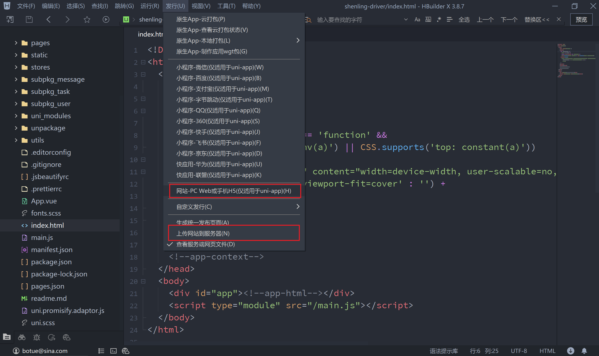

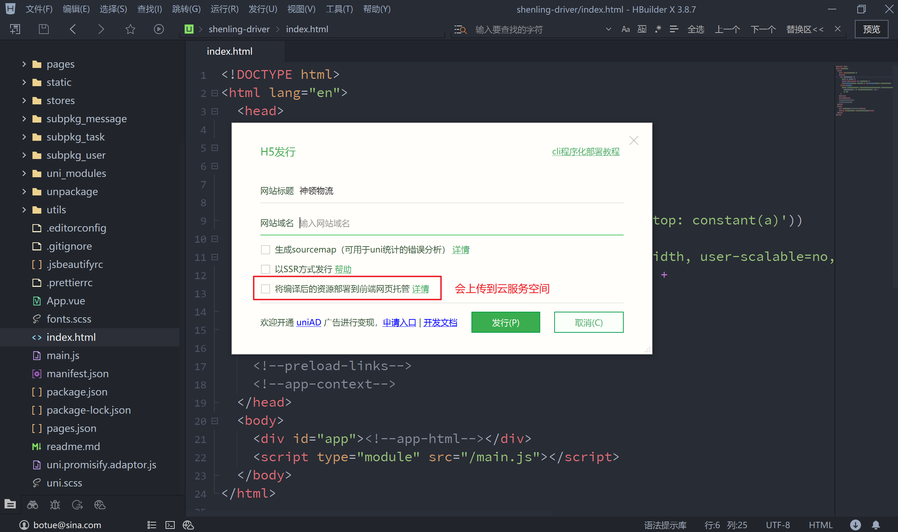

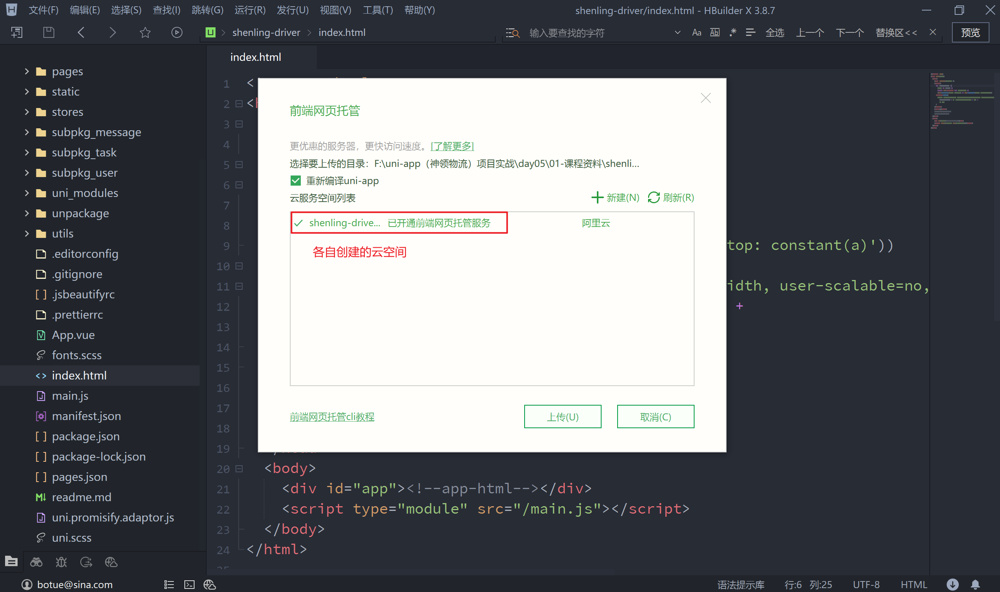

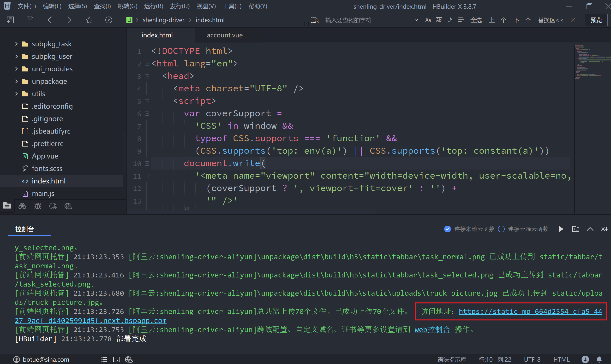

以上步骤的操作会在本地打包好 H5端的代码，位于项目根目录下的 `unpackage/dist/build/h5` 目录下，同时也可以将打包好的代码上传到服务空间。

注意：在 uniCloud 选择的阿里云免费服务空间，提供给大家一个免费的域名来使用，但是该域名的使用具有一定的限制。具体的说明大家可以[看这里](https://zh.uniapp.dcloud.io/uniCloud/hosting.html#default-domain-ip-whitelist)。

打包到H5端并上传到服务器运行时，登录成功后无法正常跳转，检测发现代码出错位置在这里：

```vue
<!-- pages/login/components/account.vue -->
<script setup>
  import { ref, reactive } from 'vue'
	
  // 省略中间部分代码...

  // 监听表单提交
  async function onFormSubmit() {
    try {
      
      // 省略中间部分代码...
      
      // 这里的报错说 xxx 不是一个函数
      uni[routeType.value]({url: redirectURL.value})
      
    } catch (err) {
      // ...
    }
  }
</script>
```

代码语法是没有问题的，初步怀疑是 uni-app 打包的问题，解决该问题的方法如下：

```vue
<!-- pages/login/components/account.vue -->
<script setup>
  import { ref, reactive } from 'vue'
	
  // 省略中间部分代码...

  // 监听表单提交
  async function onFormSubmit() {
    try {
      
      // 省略中间部分代码...
      
      // 地址重定向或switchTab
      if (routeType.value === 'switchTab') {
        uni.switchTab({ url: redirectURL.value })
      } else {
        uni.redirectTo({ url: redirectURL.value })
      }
      
    } catch (err) {
      // ...
    }
  }
</script>
```

##### 2.2 小程序端

打包小程序的步骤如下图所示：

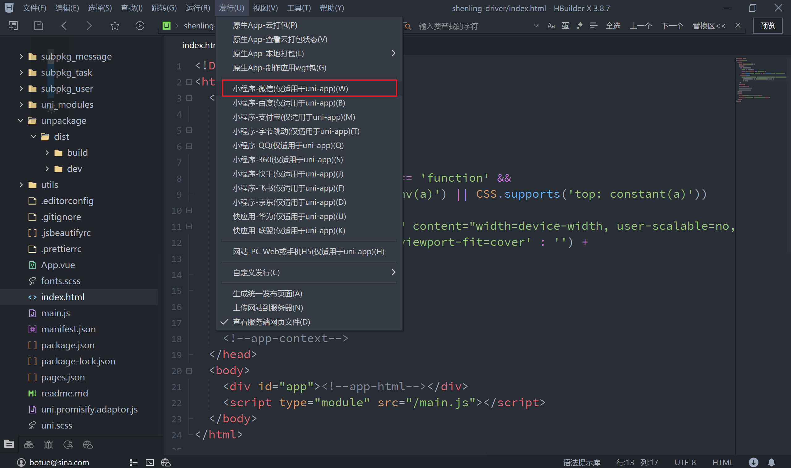

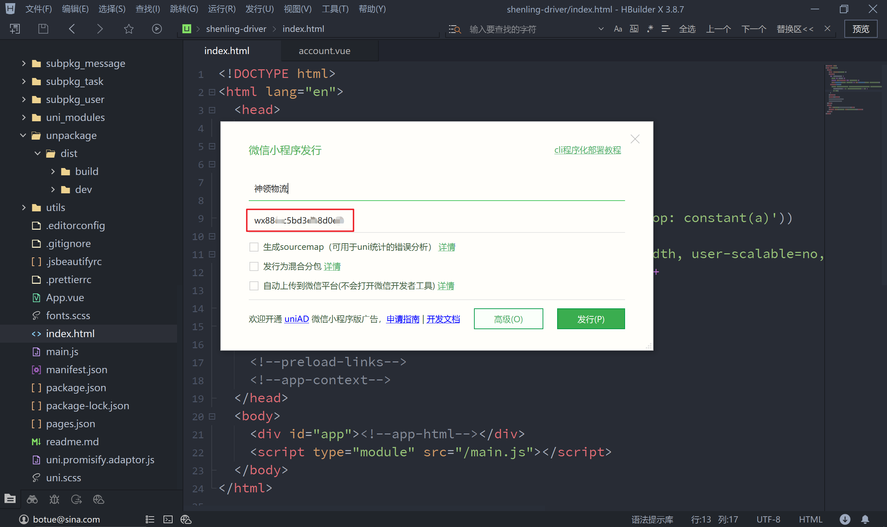

以上的方式会将小程序端的代码打包到 `unpackage/dist/build/mp-weixin` 目录中，并自动打开小程序开发者工具来运行打包好的微信小程序，此时在微信小程序开发工具中选择上传即可。

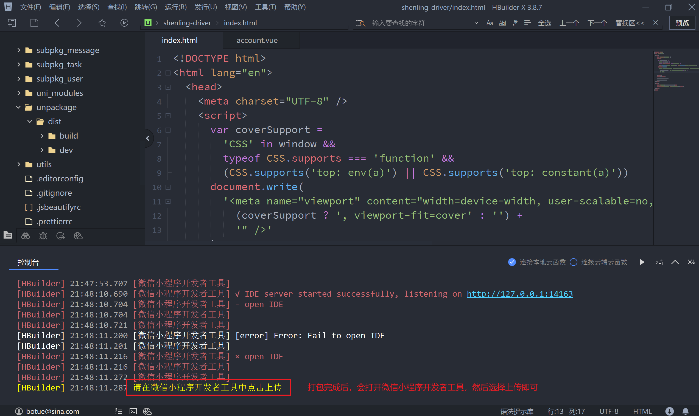

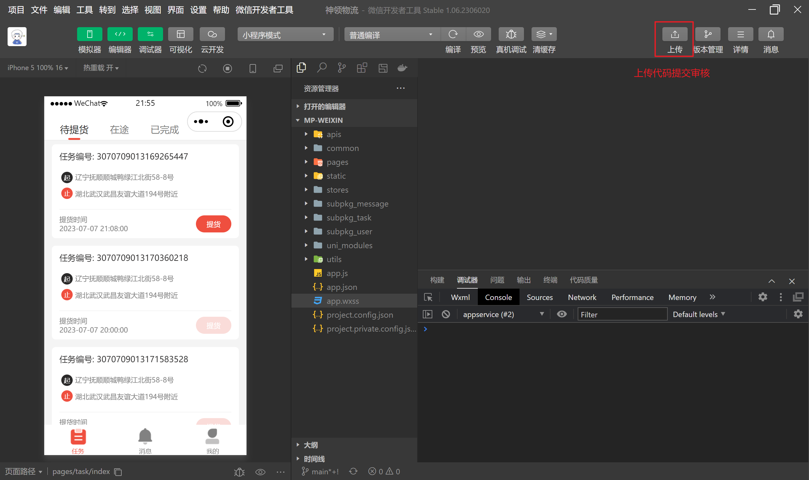


##### 2.3 App端

在发布 App 端时有本地打包和云打包两种方式，本地打包要求本地具有 Android Studio 或 XCode 的环境，这种方式对于前端人员来说成本较高，云打包是由 uni-app 平台提供的免费服务，我们选择此种方式实进行打包。

1. 配置 App 的图标

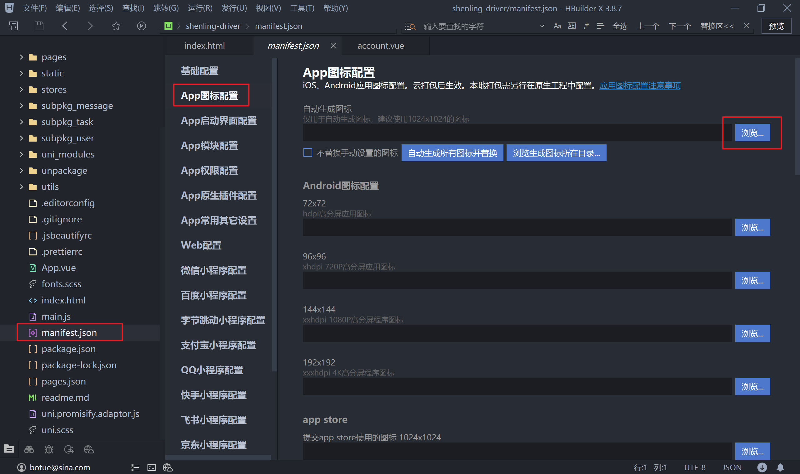

2. 配置启动界面（闪屏）

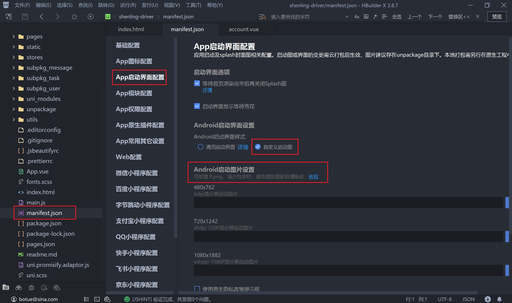

3. 指定 SDKVersion，使用 Vue3 开发时要求最低为 21

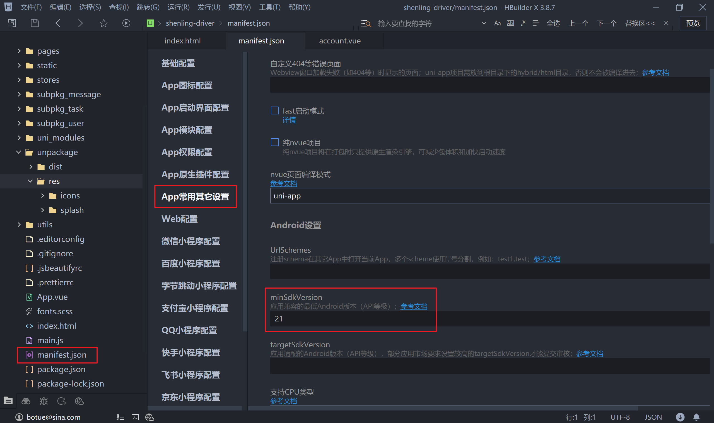

4. 配置模块

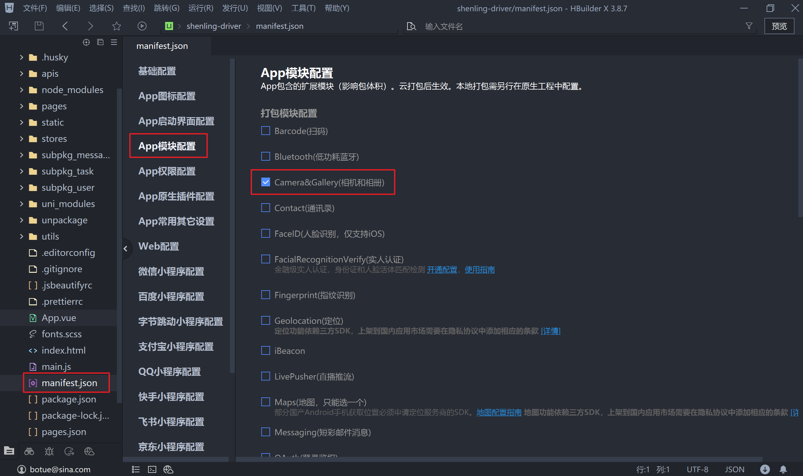

4. 云打包

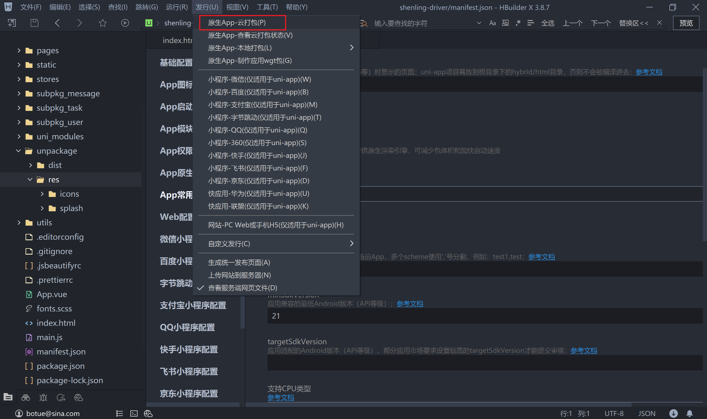

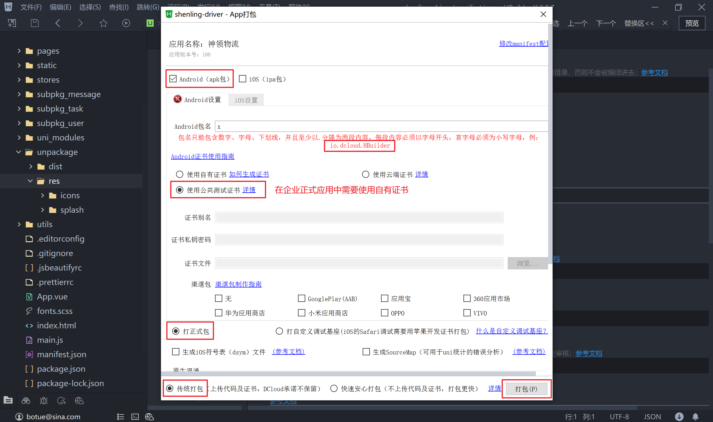

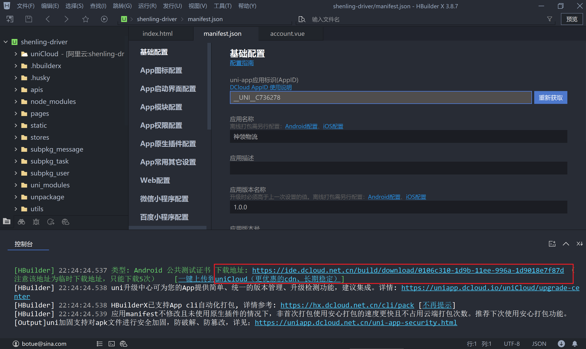


